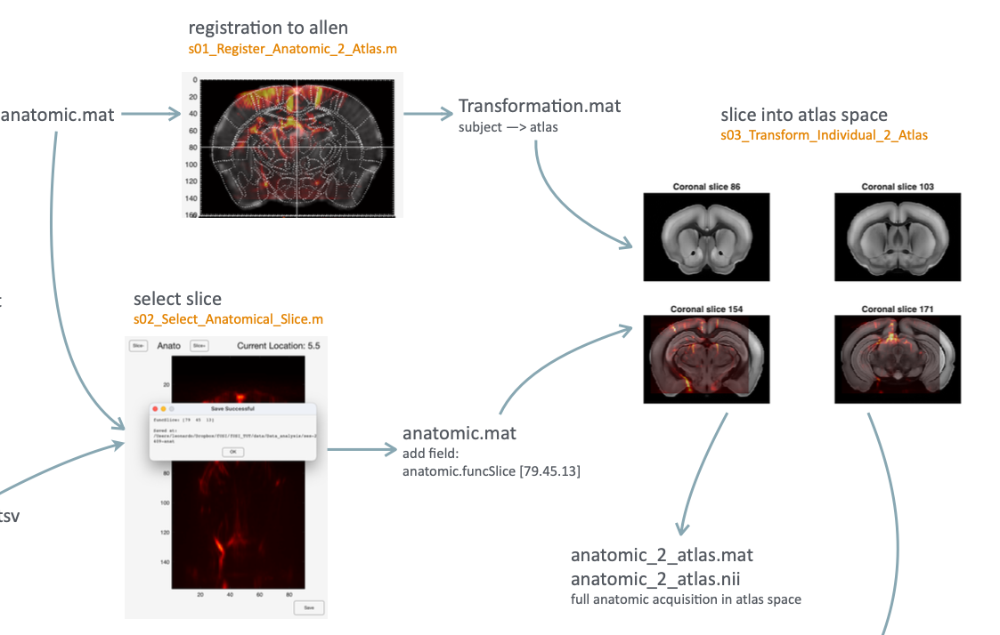

# fUSI tutorial v 0.0.1 Beta

_LC 2026-04-09_

The tutorial is still under development. 
Therefore, I advise to fork and _then_ clone the repo from your own fork[^1]. Testing and feedback is very much welcome!

**Please refer only to the content of the [V3 folder](https://github.com/leonardocerliani/fUSI_TUT/tree/main/scripts/V3) and to [the corresponding README.md](https://github.com/leonardocerliani/fUSI_TUT/blob/main/scripts/V3/README.md).**

The manual directory is very outdated, so please do not consider it. Instead, you can find detailed README for every step of the pipeline inside the 00-04 folders in V3.

[^1]: For the SBL people I advise you to clone your fork in your personal (or group) folder in `data00` and to run it from there. The data will stay on the storage disks (e.g. `data03`)
