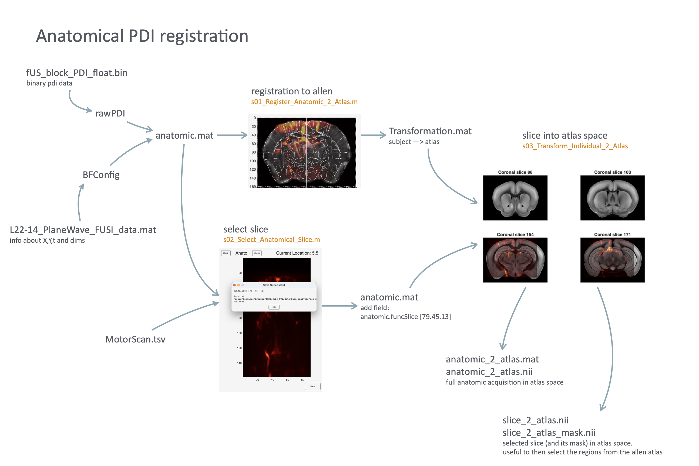
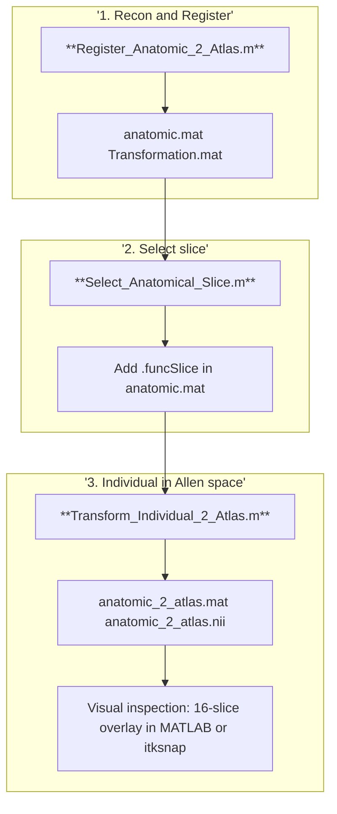

# Anatomical Reconstruction and Registration to Allen atlas


## Table of Contents

- [Overview](#overview)
- [`Register_Anatomic_2_Atlas.m`](#register_anatomic_2_atlasm)
- [`Select_Anatomical_Slice.m`](#select_anatomical_slicem)
- [`Save_Individual_2_Atlas.m`](#save_individual_2_atlasm)
- [Voxel size, dimensions and orientation in the transformed anatomic](#voxel-size-dimensions-and-orientation-in-the-transformed-anatomic)
- [Flowchart](#flowchart)





## Overview

Our current fUS setting allows acquiring data only from one specific slice in the brain. Therefore we need to identify it before the experiment.

To do so we acquire an "anatomical" image - _de facto_ a functional scan on multiple locations, and after reconstruction we select the desired slice. Finally we can proceed to acquire the actual fUS data from this slice.

Three scripts are to be run, in the order specified here. 

`Register_Anatomic_2_Atlas.m`

- First we need to reconstruct the anatomical bin file into a mat structure. This is similar - but simpler - to what is done for functional data.
- A UI is then launched to (optionally) crop the data, and finally to register the anatomic data to the allen atlas. 
- Here we should select the appropriate run folder in the `Data Acquisition` directory.
- Remember to press `save` after you have realigned the anatomical to the allen atlas!
- The result is an `anatomic.mat` and a `Transformation.mat` files in the DATA_ANALYSIS folder.


`Select_Anatomical_Slice.m`

- Once the anatomical has been acquired, reconstructed and registered to Allen space, we must select which slice of the anatomical we want to use for the functional acquisition
- From now on, we select folders from the `Data_analysis` directory.
- The registration to Allen was necessary since we need to check which slice we want to select on the Allen atlas
- When launching the script, select the appropriate run subfolder in the _Data_analysis_ folder
- No output is generated. Rather a field `.funcSlice` is added to the `anatomic.mat`


`Transform_Individual_2_Atlas.m`

- Then we can apply this transformation to the whole volume and get both a .mat and a nifti (.nii) file of the `anatomic_2_atlas`. The script provides in matlab a picture of 16 sample slices overlaid onto the atlas.
- At this point we can use e.g. itksnap to overlay the full `anatomic_2_atlas.nii` onto `atlas.nii` in order to check the registration.


## Register_Anatomic_2_Atlas.m

```bash
Registration/Register_Anatomic_2_Atlas.m

# Args:
- mandatory: none
- optional: none

## DEPENDENCIES
# scripts
./Registration/BrunnerCodes/registrationccf.m
./Registration/CropData.m
./Registration/allen_brain_atlas.mat

# subject-specific files
├── FUSI_data
│   ├── L22-14_PlaneWave_FUSI_data.mat
│   ├── fUS_block_PDI_float.bin
│   └── post_L22-14_PlaneWave_FUSI_data.mat
└── TTL20231215T113402.csv

# other files
allen_brain_atlas.mat
```


**Input in DATA_COLLECTION :**

- directory with FUSI_data with anatomical bin data
- allen_brain_atlas.mat


**Output IN DATA_ANALYSIS :**

- `anatomic.mat`
- `Transformation.mat`
1. Launches a UI to select one RUN folder from the `Data_collection` folder containing the raw anatomical scan data.
2. Reads TTL information and the raw PDI data from the selected folder.
3. Crops and processes the 3D volume (if required).
4. Saves the processed anatomical data to the corresponding `Data_analysis` folder.
5. Registers the processed scan to the Allen Brain Atlas.
6. Saves the transformation in `Transformation.mat`.

**NB: If a Transformation.mat is already present, it is loaded instead of launching the registration UI**


## Select_Anatomical_Slice.m

`Registration/Select_Anatomical_Slice.m`

`DEPENDENCIES: None`

**The reconstruction and registration is mostly done during the experiment**. In this session, the experimenter also checks the registration on the atlas in mricro and notes down which slice should be chosen. This appears then in the anatomic.mat as the field `.funcSlice(3)`

In order to do so, the experimenter currently uses two scripts which are in `data08/fUSI/fUSIexperiment`:

- `CheckRegistrationEXP.m`
- `checkAnatomical.m`
  We need to do this manually because otherwise we cannot proceed  with the Preprocessing.

For the moment - since I don't know how the interaction with MRIcro is done - I refactored the `checkAnatomical.m` into this script `Select_Anatomical_Slice.m`, which does the following:

- prompts the user to select a `Data_analysis` folder where both `anatomic.mat` and `Transformation.mat` should be present.

- opens a UI where the user can select the desired slice and save it as `funcSlice` field in the `anatomic.mat`

  

**Noteworthy**:

- I added a uigetdir prompt for the directory since the `anatomic.mat` file in which the `.funcSlice` field is written is specified in the `.savepath` field, so if might not be the currently loaded anatomic variable in the working environment.
- the script records the desired slice in a 3 element array like `[79,45,19]`, but only the last number - which is the slice number of the selected slice - is used. You can see this e.g. in the `Preprocessing.m` script. **We should investigate this further**. 


## Transform_Individual_2_Atlas.m

`Registration/Save_Individual_2_Atlas.m`

DEPENDENCIES

```
    ./Registration/allen_brain_atlas.mat
    ./Registration/BrunnerCodes/interpolate3D.m
    ./Registration/freesurfer_matlab/load_nifti.m
    ./Registration/freesurfer_matlab/save_nifti.m
```

Required arguments from command line: None.


**Input in DATA_ANALYSIS :**

- anatomic.mat
- Transformation.mat
- allen_brain_atlas.mat
- allen.nii

**NB: At this stage it is important to make sure that the allen brain atlas is available in the path**


**Output in DATA_ANALYSIS :**

- anatomic_2_atlas.mat
- anatomic_2_atlas.nii
1. Loads the `anatomic.mat` and `Transformation.mat` from the DATA_ANALYSIS directory.
2. Applies the affine transformation to `anatomic.mat`
3. Loads the struct from the allen brain atlas and saves an analogous structure in `anatomic_2_atlas.mat` where the data are in the `.Data` field.
4. Loads the `atlas.nii` and saves an `anatomic_2_atlas.nii` with the same specs of the atlas, so that one can overlay the latter on the former.
5. visualize the overlay in 16 samples slices


## Voxel size, dimensions and orientation in the transformed anatomic

Before applying the affine transformation, the anatomical.mat volume is fed into the `interpolate3D.m` function, which ensures that the final transformed volume will have exactly the same dimensions, voxel size and orientation of the allen atlas.

Because of this, in order to generate the `anatomic_2_atlas.mat` and `anatomic_2_atlas.nii` we only need to do the following:

For the mat file:

- load the `allen_brain_atlas.mat` 
- get the voxel size, direction, and other information (e.g. regions and infoRegions) 
- create a new struct
- create a new `.Data` field and insert in it the volumetric image
- save the new anatomic_2_atlas.mat file

For the nifti file:

- load_nifti the `atlas.nii` into a `hdr` variable, which contains all the info about voxel size, orientation usw.
- copy the image in the `.vol` field of the hdr struct
- save_nifti the anatomic_2_atlas.nii file


## Flowchart




