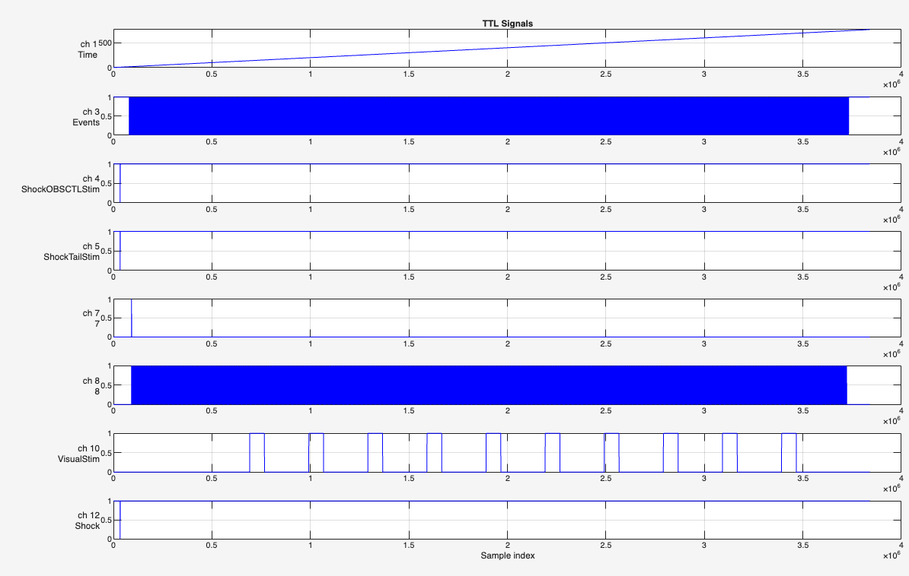

# RAW_2_MAT.m - Technical Documentation

## Overview

`RAW_2_MAT.m` is the primary reconstruction script for functional ultrasound imaging (fUSI) data. It converts raw ultrasound data, hardware timing signals, and experimental event logs into a single, synchronized, analysis-ready MATLAB structure saved as `PDI.mat`.

**Purpose**: Synchronize and align multiple data streams from a functional ultrasound imaging experiment:
- Raw Power Doppler Imaging (PDI) binary data
- Hardware timing signals (TTL)
- Experimental stimulation events (shock, visual, auditory)
- Behavioral measurements (running wheel, head motion, pupil tracking)

**Key Functionality**:
1. Loads and reshapes raw ultrasound data
2. Synchronizes imaging frames with hardware timing signals
3. Corrects for timing irregularities (lag correction)
4. Aligns all data streams to a common timeline (t=0)
5. Extracts and categorizes stimulation events
6. Integrates behavioral data
7. Produces structured output for downstream analysis

## Dependencies

### Required External Functions
- **LagAnalysisFusi**: Analyzes IQ data for precise frame timing correction (optional - graceful fallback if unavailable)

### Optional Utilities (for QC visualization)
- **fun_plot.plotTTL**: Plots TTL timing signals
- **fun_plot.pdi_movie**: Displays PDI data as movie

### MATLAB Requirements
- Core MATLAB (no special toolboxes required)
- Standard functions: `readmatrix`, `readtable`, `fread`, `fopen`, `reshape`, `diff`, `find`

## Expected Input Structure

### Directory Organization
```
Data_collection/
└── [subject]/
    └── [session]/
        └── run-[number]-func/
            ├── TTL*.csv                    [REQUIRED]
            ├── NIDAQ.csv or DAQ.csv        [REQUIRED]
            ├── VisualStimulation.csv       [optional]
            ├── auditoryStimulation.csv     [optional]
            ├── ShockStimulation.csv        [optional]
            ├── GSensor.csv                 [optional]
            ├── WheelEncoder.csv            [optional]
            ├── flir_camera_time.csv        [optional]
            ├── settings.json               [optional]
            └── FUSI_data/                  [REQUIRED]
                ├── fUS_block_PDI_float.bin [REQUIRED]
                ├── L22-14_PlaneWave_FUSI_data.mat [REQUIRED]
                └── post_L22-14_PlaneWave_FUSI_data.mat [optional, preferred]
```

### Required Files
1. **fUS_block_PDI_float.bin**: Raw PDI data (32-bit floats, single precision)
2. **L22-14_PlaneWave_FUSI_data.mat**: Scan parameters (BFConfig structure)
3. **TTL*.csv**: Hardware timing signals (13 channels)
4. **NIDAQ.csv or DAQ.csv**: Data acquisition log with event markers

### Optional Files
- **Stimulation CSVs**: Metadata for experimental events
- **Behavioral CSVs**: Running wheel, accelerometer, pupil tracking data
- **post_***.mat**: Post-processed scan parameters (preferred over regular version)

## Output Structure

### PDI.mat File Contents
```matlab
PDI (struct)
├── PDI [nz × nx × nt double]       % Power Doppler Imaging data
├── Dim (struct)
│   ├── nx, nz                      % Spatial dimensions (pixels)
│   ├── dx, dz                      % Pixel spacing (mm)
│   ├── nt                          % Number of time points
│   └── dt                          % Frame interval (seconds)
├── time [nt × 1 double]            % Aligned frame timestamps
├── stimInfo (table)                % Stimulation events
│   ├── stimCond                    % Event type (visual, shock, etc.)
│   ├── startTime                   % Event start (seconds)
│   └── endTime                     % Event end (seconds)
├── pupil (struct)
│   └── pupilTime                   % Camera timestamps
├── wheelInfo (table)               % Running wheel data
│   ├── time                        % Timestamps
│   └── wheelspeed                  % Speed values
├── gsensorInfo (table)             % Head motion (accelerometer)
│   ├── time                        % Timestamps
│   └── x, y, z                     % Acceleration axes
└── savepath [char]                 % Output directory path
```

### Output Location
Automatically generated in `Data_analysis/` directory mirroring the input path structure:
```
Data_analysis/
└── [subject]/
    └── [session]/
        └── run-[number]-func/
            └── PDI.mat
```

---

# Processing Steps

## 1. Load Scan Parameters

### What Happens
This section loads critical ultrasound imaging configuration parameters from MAT files. These parameters define the spatial dimensions and physical scaling of the imaging data.

### Code Breakdown

```matlab
%% Load scan parameters
scanParamFiles = {'post_L22-14_PlaneWave_FUSI_data.mat', ...
                  'L22-14_PlaneWave_FUSI_data.mat'};
BFConfig = [];
```

**Purpose**: Sets up a priority list of parameter files to check
- `post_L22-14_PlaneWave_FUSI_data.mat` - Post-processed parameters (preferred)
- `L22-14_PlaneWave_FUSI_data.mat` - Original acquisition parameters (fallback)

```matlab
for i = 1:length(scanParamFiles)
    scanParamPath = fullfile(fusDatapath, scanParamFiles{i});
    if exist(scanParamPath, 'file')
        fprintf('Loading scan parameters from %s.\n', scanParamFiles{i});
        S = load(scanParamPath, 'BFConfig');
        BFConfig = S.BFConfig;
        break;  % Stop after first successful load
    end
end
```

**Search Logic**:
1. Iterates through parameter file list in priority order
2. Checks if each file exists
3. Loads **only** the `BFConfig` variable (efficient partial loading)
4. Stops immediately after first successful load
5. Result: `BFConfig` contains the highest-priority available parameters

```matlab
if isempty(BFConfig)
    error('No scan parameter file found. Please check the fusDatapath.');
end
```

**Validation**: Fatal error if no parameter file is found - cannot proceed without imaging geometry.

### What is BFConfig?

`BFConfig` is a structure containing **beamforming configuration parameters** - the settings that define how ultrasound signals were converted into images.

#### Critical Fields Used in Reconstruction

**Spatial Dimensions**:
```matlab
BFConfig.Nx          % Width in pixels (e.g., 128)
BFConfig.Nz          % Depth in pixels (e.g., 256)
BFConfig.ScaleX      % Pixel width in mm (e.g., 0.1 mm)
BFConfig.ScaleZ      % Pixel height in mm (e.g., 0.05 mm)
```

**Imaging Geometry**:
```matlab
BFConfig.Xmin, Xmax  % Field of view boundaries in x (mm)
BFConfig.Zmin, Zmax  % Field of view boundaries in z (mm)
BFConfig.probe       % Probe specifications
BFConfig.angles      % Plane wave steering angles
```

**Signal Processing**:
```matlab
BFConfig.fc          % Center frequency (MHz)
BFConfig.fs          % Sampling frequency (MHz)
BFConfig.c           % Speed of sound (m/s, typically 1540)
BFConfig.PRF         % Pulse repetition frequency (Hz)
```

### Origin of Parameter Files

#### Filename Anatomy: `L22-14_PlaneWave_FUSI_data.mat`

**L22-14**: Linear array probe model
- High-frequency ultrasound transducer (15-22 MHz range)
- Designed for small animal imaging (mice, rats)
- 128 individual transducer elements

**PlaneWave**: Acquisition technique
- Transmits unfocused ultrasound waves across entire field
- Enables very high frame rates (1-10 Hz for functional imaging)
- Faster than traditional focused scanning

**FUSI_data**: Functional ultrasound imaging dataset identifier

#### Two File Versions

**1. Regular Version: `L22-14_PlaneWave_FUSI_data.mat`**
- Created **during acquisition** by ultrasound scanner
- Contains intended beamforming parameters
- Automatically saved when starting functional scan

**2. Post-processed Version: `post_L22-14_PlaneWave_FUSI_data.mat`**
- Created **after acquisition** during offline processing
- May contain corrected or optimized parameters
- **Preferred** because it reflects actual processing used to generate PDI data
- Only present if IQ data was reprocessed offline

### Why These Parameters Matter

#### 1. Binary Data Reshaping
The PDI binary file contains a 1D stream of float values. Without `Nx` and `Nz`, we cannot reconstruct the 2D images.

**Example**:
- Binary file: `[val1, val2, val3, ..., val32768000]`
- With `Nx=128`, `Nz=256`, `nt=1000`:
- Reshape to: `[256 × 128 × 1000]` array
- Each time slice is a 256×128 ultrasound image

#### 2. Spatial Calibration
`ScaleX` and `ScaleZ` convert pixel coordinates to physical distances (millimeters).

**Example**:
- Pixel (50, 100) with `ScaleX=0.1`, `ScaleZ=0.05`
- Physical position: `(5.0 mm, 5.0 mm)` from probe surface
- Enables quantitative spatial analysis

#### 3. Metadata Preservation
Storing these parameters in output ensures processed data retains acquisition context.

### Design Pattern: Dual-Source Fallback

This is an example of **robust file loading** - trying multiple file names to handle different data organization schemes:

**Benefit**: Script doesn't fail if only one version exists
**Rationale**: Different processing workflows may generate different file names
**Priority**: Post-processed version preferred as it matches actual PDI data

### Error Handling

**Fatal Error**: No parameter files found
- **Reason**: Cannot proceed without knowing data dimensions
- **User Action**: Verify FUSI_data directory contains at least one parameter MAT file

**Success**: Script continues with loaded BFConfig structure available for subsequent steps.

---

## 2. Read Raw PDI Data

### What Happens
This section reads the binary PDI (Power Doppler Imaging) data file - the core imaging data containing blood flow information.

### Code Breakdown

```matlab
%% Read Raw PDI Data
pdiFile = fullfile(fusDatapath, 'fUS_block_PDI_float.bin');

if exist(pdiFile, 'file')
    fprintf('Loading PDI data from %s.\n', 'fUS_block_PDI_float.bin');
    fid = fopen(pdiFile, 'r');
    rawPDI = fread(fid, inf, 'single');
    fclose(fid);
else
    error('No PDI data found. Please convert IQ data to PDI first.');
end
```

**File Reading**:
1. Constructs full path to `fUS_block_PDI_float.bin` in FUSI_data directory
2. Opens file in binary read mode (`'r'`)
3. Reads entire file as 32-bit floating point values (`'single'`)
   - `inf` means read all available data
   - Result: 1D vector of float values
4. Closes file handle

**Data Format**: 
- Binary file containing single-precision (32-bit) floating point numbers
- No header, no structure - just raw sequential values
- Represents flattened 3D data: [depth × width × time]
- Will be reshaped later using BFConfig dimensions

**Error Handling**:
- **Fatal error** if file not found
- Message indicates IQ-to-PDI conversion is a prerequisite step
- This conversion happens before running RAW_2_MAT.m

**Output**: `rawPDI` - 1D vector containing all PDI values, ready for reshaping.

---

## 3. Read TTL File

### What Happens
This section loads hardware timing signals (TTL - Transistor-Transistor Logic) that synchronize all data acquisition systems. TTL signals are the timing backbone of the experiment, providing precise markers for:
- PDI frame acquisition timing
- Experimental stimulation events (shock, visual, auditory)
- Experiment start/stop markers
- Behavioral data synchronization

### Code Breakdown

```matlab
%% Read TTL Timing Information
ttlFiles = dir(fullfile(datapath, 'TTL*.csv'));

if ~isempty(ttlFiles)
    fprintf('Loading TTL data from %s.\n', ttlFiles(1).name);
    TTLinfo = readmatrix(fullfile(ttlFiles(1).folder, ttlFiles(1).name));
else
    error('No TTL recording found. Please check the datapath.');
end

% plot the TTLinfo
fun_plot.plotTTL(TTLinfo)
```

**File Discovery**:
1. Searches for files matching pattern `TTL*.csv` in data directory
2. Uses first matching file if multiple exist
3. Typical filename: `TTL20231215T115044.csv` (with timestamp)

**File Loading**:
- `readmatrix()` reads entire CSV as numeric matrix
- No headers in file - pure numeric data
- Result: `TTLinfo` matrix with dimensions [nSamples × 13]

**Visualization**:
- Optional call to `fun_plot.plotTTL()` for quality control
- Displays all active (non-zero) channels
- Helps verify timing signal quality

### TTL Data Structure

**Matrix Dimensions**: [nSamples × 13 channels]

**Sampling Rate**: ~5000 Hz (0.0002 second intervals)
- High temporal resolution for precise event detection
- Typical recording duration: Several minutes
- Example: 10-minute recording = ~3,000,000 samples

**Data Format**: 
- Column 1: Time (seconds, starting from 0)
- Columns 2-13: Digital signal states (0 or 1)
- Each row represents one time sample

### TTL Channel Assignments

Based on the `TTLinfo_colNames()` function, channels are assigned as follows:

| Channel | Name | Purpose |
|---------|------|---------|
| 1 | Time | Timestamp in seconds |
| 2 | (unused) | - |
| 3 | Events | **PDI frame markers** - falling edge indicates new frame acquired |
| 4 | ShockOBSCTLStim | Shock stimulation (observed/control paradigms) |
| 5 | ShockTailStim | Tail shock stimulation |
| 6 | AdjustPDItime | **Experiment start marker** - first rising edge = t=0 reference |
| 7-9 | (unused) | - |
| 10 | VisualStim | Visual stimulation events |
| 11 | AuditoryStim | Auditory stimulation events |
| 12 | Shock | General shock signal |
| 13 | (unused) | - |

### Critical Channels for Reconstruction

**Channel 3 (Events - PDI Frame Markers)**:
- **Falling edge** (1→0 transition) marks when a PDI frame was acquired
- Used to synchronize imaging data with TTL timeline
- Number of falling edges should match number of PDI frames

**Channel 6 (AdjustPDItime - Experiment Start)**:
- **Rising edge** (0→1 transition) marks the beginning of the experiment
- Used as reference point to establish t=0 for all data streams
- Fallback to channel 5 if channel 6 is inactive

**Channels 4, 5, 12 (Shock Stimulation)**:
- Multiple channels for different shock paradigms
- Edge detection extracts event timing
- Combined with CSV metadata for complete event information

**Channel 10 (Visual Stimulation)**:
- Rising edge = stimulus onset
- Falling edge = stimulus offset
- Duration calculated from edge timing

**Channel 11 (Auditory Stimulation)**:
- Similar to visual: edges mark onset/offset
- Used for conditioned stimulus (CS) in learning experiments

### Example TTL Visualization



The plot shows multiple channels stacked vertically:
- Each channel displays its signal state (0 or 1) over time
- Active channels show state transitions (edges)
- Channel labels indicate their function
- This visualization aids in verifying signal quality and event timing

### Why TTL Synchronization is Critical

**Problem**: Multiple data acquisition systems with independent clocks
- Ultrasound scanner records PDI frames
- Stimulation computer logs events
- Behavioral sensors sample continuously
- Each has its own timestamp system

**Solution**: TTL hardware signals
- Single timing source distributed to all systems
- Provides common reference for synchronization
- Allows precise alignment of all data streams in post-processing

**Without TTL**: Cannot reliably align imaging frames with stimulation events - temporal precision would be ~100-1000ms

**With TTL**: Temporal alignment precision ~0.2ms (limited by TTL sampling rate)

### Error Handling

**Fatal Error**: No TTL file found
- **Reason**: Cannot synchronize data streams without timing reference
- **User Action**: Verify TTL recording was enabled during acquisition

**Success**: `TTLinfo` matrix loaded and ready for:
1. PDI frame synchronization
2. Event extraction (shock, visual, auditory)
3. Timeline alignment (establishing t=0)
4. Temporal validation

---

## 4. Read NIDAQ/DAQ File

### What Happens
This section loads the NIDAQ (National Instruments Data Acquisition) log file, which records experimental events from the stimulation control computer. This file provides high-level event markers and timing information that complements the low-level TTL signals.

### Code Breakdown

```matlab
%% Read NIDAQ Logfile
nidaqFiles = {'NIDAQ.csv', 'DAQ.csv'};

NIDAQInfo = [];

for i = 1:length(nidaqFiles)
    nidaqPath = fullfile(datapath, nidaqFiles{i});
    if exist(nidaqPath, 'file')
        fprintf('Loading NIDAQ logfile from %s.\n', nidaqFiles{i});
        NIDAQInfo = readtable(nidaqPath);
        break;
    end
end

if isempty(NIDAQInfo)
    error('No NIDAQ logfile found. Please check the datapath.');
end
```

**File Discovery**:
- Tries two possible filenames: `NIDAQ.csv` or `DAQ.csv`
- Different naming conventions across acquisition systems
- Uses first file found

**File Loading**:
- `readtable()` reads CSV with automatic header parsing
- Returns MATLAB table structure with named columns
- Preserves column names for easy access

**Error Handling**:
- **Fatal error** if neither file version is found
- Cannot proceed without event timing reference

### What is the NIDAQ/DAQ File?

The NIDAQ file is a **high-level event log** created by the experiment control software (typically running on a separate computer from the ultrasound scanner). It records:

**Event Markers**: State changes for experimental events
- Visual stimulation on/off
- Auditory stimulation on/off
- Shock delivery events
- Recording session start/stop
- Camera triggers

**Timing Information**: Unix timestamps (seconds since epoch)
- Absolute time reference
- Independent from TTL timestamps
- Used for cross-validation and behavioral data alignment

### File Structure

**Example from run-115047-func/DAQ.csv** (first 10 data rows):

| time | visual | audio | shock_left | shock_right | shock_tail | recording_start | stim_start | camera_ttl_trigger |
|------|--------|-------|------------|-------------|------------|-----------------|------------|--------------------|
| 1702637451.576 | 0 | 0 | 1 | 1 | 1 | 0 | 0 | 0 |
| 1702637451.576 | 0 | 0 | 1 | 1 | 1 | 0 | 0 | 0 |
| 1702637463.194 | 0 | 0 | 1 | 1 | 1 | 0 | 1 | 1 |
| 1702637463.205 | 0 | 0 | 1 | 1 | 1 | 0 | 0 | 1 |
| 1702637583.217 | 1 | 0 | 1 | 1 | 1 | 0 | 0 | 1 |
| 1702637598.200 | 0 | 0 | 1 | 1 | 1 | 0 | 0 | 1 |
| 1702637643.208 | 1 | 0 | 1 | 1 | 1 | 0 | 0 | 1 |
| 1702637658.213 | 0 | 0 | 1 | 1 | 1 | 0 | 0 | 1 |
| 1702637703.194 | 1 | 0 | 1 | 1 | 1 | 0 | 0 | 1 |
| 1702637718.208 | 0 | 0 | 1 | 1 | 1 | 0 | 0 | 1 |

**Column Descriptions**:

| Column | Type | Description |
|--------|------|-------------|
| `time` | float | Unix timestamp (seconds since Jan 1, 1970) |
| `visual` | binary | Visual stimulation state (1=on, 0=off) |
| `audio` | binary | Auditory stimulation state (1=on, 0=off) |
| `shock_left` | binary | Left shock channel state (inverted: 1=off, 0=on) |
| `shock_right` | binary | Right shock channel state (inverted: 1=off, 0=on) |
| `shock_tail` | binary | Tail shock channel state (inverted: 1=off, 0=on) |
| `recording_start` | binary | Recording session marker (1=start) |
| `stim_start` | binary | Stimulation protocol start marker (1=start) |
| `camera_ttl_trigger` | binary | Camera synchronization trigger (1=active) |

**Key Observations**:
- **Sparse sampling**: Events logged only when state changes occur (not continuous)
- **Unix timestamps**: Absolute time reference (e.g., 1702637451.576 = Dec 15, 2023, ~11:50 AM)
- **State transitions**: Each row represents a change in system state
- **Visual stimulation**: In this example, visual stimulus alternates on/off (rows 5-6, 7-8, 9-10)

### Why This File is Necessary

#### 1. Behavioral Data Alignment
**Critical for synchronizing behavioral sensors** (wheel, accelerometer, pupil camera):

```matlab
% Example from script:
wheelInfo.time = wheelInfo.time - NIDAQInfo.Var1(1);
gsensorInfo.time = gsensorInfo.time - NIDAQInfo.time(1);
```

- Behavioral data has its own timestamp system
- NIDAQ provides common time reference
- First NIDAQ timestamp used as offset for alignment

**Why**: Behavioral sensors and DAQ share the same computer clock, enabling precise alignment.

> **📝 NOTE**: The exact mechanism and rationale for subtracting `NIDAQInfo.time(1)` (or `NIDAQInfo.Var1(1)`) from behavioral timestamps is subtle and will be revisited in detail when we document the visual stimulation extraction section. The key point is that this converts absolute Unix timestamps to experiment-relative time, but the full picture becomes clearer when examining how stimulation events are processed.

#### 2. Fallback Event Timing
**When TTL signals are unavailable or incomplete**:

The script uses NIDAQ timestamps as fallback for stimulation events:

```matlab
% Example for visual stimulation (from script):
if isempty(PDI.stimInfo.startTime)
    % Adjust stimInfo times relative to start of NIDAQ recording
    stimInfo.time = stimInfo.time - NIDAQInfo.Var1(1);
    
    % Get start/end times directly from stimInfo table
    PDI.stimInfo.startTime = stimInfo.time(strcmp('stim', stimInfo.stim));
    PDI.stimInfo.endTime   = stimInfo.time(strcmp('black', stimInfo.stim));
end
```

**When used**:
- TTL channel for a stimulus type not connected
- TTL signal quality issues
- Provides redundancy in timing system

#### 3. Cross-Validation
**Verifies TTL timing accuracy**:
- Compare NIDAQ event times with TTL-derived times
- Detect timing drift or synchronization issues
- Quality control for temporal alignment

#### 4. Absolute Time Reference
**Preserves real-world timing**:
- Links experiment to wall-clock time
- Enables correlation with external events
- Important for multi-session studies

### Relationship to TTL Signals

**NIDAQ vs TTL - Complementary Systems**:

| Aspect | TTL Signals | NIDAQ Log |
|--------|-------------|-----------|
| **Temporal Resolution** | ~0.2 ms (5 kHz sampling) | Variable (~1-100 ms) |
| **Coverage** | Hardware-level, all systems | Software-level, control computer only |
| **Primary Use** | Frame synchronization, precise timing | Event logging, behavioral alignment |
| **Timestamp Format** | Relative (seconds from 0) | Absolute (Unix epoch) |
| **Sampling** | Continuous | Event-triggered |

**Typical Workflow**:
1. **TTL**: Primary timing source for PDI frame synchronization
2. **NIDAQ**: 
   - Provides offset for behavioral data alignment
   - Fallback for stimulus timing if TTL unavailable
   - Cross-validation of timing accuracy

### Example Use Case

**Visual Stimulation Event Extraction**:
1. **Primary method**: Extract timing from TTL channel 10 (VisualStim)
   - Rising edge = stimulus onset
   - Falling edge = stimulus offset
   - High temporal precision (~0.2 ms)

2. **Fallback method**: Use NIDAQ log if TTL empty
   - Read visual column state changes
   - Calculate onset/offset from timestamp transitions
   - Lower precision but still adequate (~1-10 ms)

3. **Behavioral data alignment**: Use NIDAQ.Var1(1) as time offset
   - First NIDAQ timestamp = reference point
   - Subtract from behavioral sensor timestamps
   - Aligns behavioral data to experiment timeline

### Error Handling

**Fatal Error**: No NIDAQ file found
- **Reason**: Cannot align behavioral data without time reference
- **User Action**: Verify DAQ recording was enabled during acquisition

**Success**: `NIDAQInfo` table loaded with:
- Event markers accessible by column name (e.g., `NIDAQInfo.visual`)
- Unix timestamps for temporal alignment
- Ready for behavioral data synchronization
- Available as fallback for stimulus timing

---

## 5. Initialize PDI Structure & Reshape Data

### What Happens
This section creates the PDI structure and reshapes the 1D binary data into a 3D array representing the complete imaging dataset.

### Code Breakdown

```matlab
%% Initialize PDI Structure
PDI = struct;
PDI.Dim.nx = BFConfig.Nx;
PDI.Dim.nz = BFConfig.Nz;
PDI.Dim.dx = BFConfig.ScaleX;
PDI.Dim.dz = BFConfig.ScaleZ;
PDI.Dim.nt = numel(rawPDI) / (BFConfig.Nx * BFConfig.Nz);
```

**Structure Initialization**:
- Creates empty `PDI` structure to hold all processed data
- Stores spatial dimensions (`nx`, `nz`) and pixel spacing (`dx`, `dz`) from BFConfig
- Calculates number of time points: `nt = total_values / (width × depth)`

```matlab
% Reshape raw PDI data into [nz, nx, nt]
pdi = reshape(rawPDI, [PDI.Dim.nz, PDI.Dim.nx, PDI.Dim.nt]);
clear rawPDI;
```

**Reshaping Operation**:
- Converts 1D vector → 3D array with dimensions `[depth × width × time]`
- **Order matters**: `[nz, nx, nt]` matches how data was written to binary file
- Clears `rawPDI` to free memory (1D array no longer needed)

```matlab
% % Show movie
% fun_plot.pdi_movie(PDI, pdi)
```

**Optional Visualization**: Commented-out movie player for quality control

### Why This Step Matters

**From 1D to 3D**:
- **Before**: `rawPDI` = `[val1, val2, val3, ..., val32768000]` (flat array)
- **After**: `pdi` = 3D array where `pdi(:,:,t)` is a 2D ultrasound image at time t

**Example**:
- `BFConfig.Nx = 128`, `BFConfig.Nz = 256`, calculated `nt = 1000`
- Input: 32,768,000 sequential float values
- Output: `pdi(256, 128, 1000)` - 1000 frames of 256×128 images
- Each frame shows blood flow in a 2D brain slice

**Result**: `pdi` now contains properly structured spatiotemporal imaging data ready for synchronization and analysis.

---

## 6. Realign Events Using TTL Information

### What Happens
This section ensures **one-to-one correspondence** between TTL timing markers and actual PDI frames. It handles the common scenario where the number of recorded timing events doesn't exactly match the number of imaging frames acquired.

### Code Breakdown

```matlab
%% Realign Events Using TTL Information

PDITTL = find(diff(TTLinfo(:,3)) < 0);
numPDITTL = numel(PDITTL);
numPDIframes = size(pdi, 3);

if numPDITTL < numPDIframes
    pdi(:, :, numPDITTL+1:end) = [];    % too many frames → cut off extras
elseif numPDITTL > numPDIframes
    PDITTL(numPDIframes+1:end) = [];    % too many events → cut off extras
end
```

### Step 1: Find PDI Frame Markers in TTL

```matlab
PDITTL = find(diff(TTLinfo(:,3)) < 0);
```

**What it does:**
- `TTLinfo(:,3)` = Channel 3 (Events channel) containing PDI frame markers
- `diff(TTLinfo(:,3))` = Calculates differences between consecutive samples
- `< 0` = Detects **falling edges** (transitions from 1→0)
- Each falling edge marks when the ultrasound scanner acquired a frame

**Why falling edges?**
The scanner sends a TTL pulse that:
- Goes HIGH (1) when starting frame acquisition
- Goes LOW (0) when frame is complete and saved
- The falling edge (1→0) is the reliable "frame done" marker

**Result:** `PDITTL` contains the row indices in TTLinfo where each frame was completed

### Step 2: Count Events vs Frames

```matlab
numPDITTL = numel(PDITTL);      % Number of TTL frame markers
numPDIframes = size(pdi, 3);     % Number of actual frames in data
```

**Compares two counts:**
- `numPDITTL`: How many frame completion events the TTL system recorded
- `numPDIframes`: How many frames are actually in the binary PDI file

**Why might these differ?**

Common causes of mismatch:
1. **Recording stopped slightly early/late**: Data acquisition and TTL recording might stop at slightly different times
2. **Race conditions**: Final frame might be incomplete when recording stopped
3. **System lag**: Brief delays between frame completion and TTL logging
4. **Buffer flushing**: Final frames in memory might not be written to disk
5. **Acquisition timing**: Scanner and TTL system have independent stop mechanisms

### Step 3: Reconcile Mismatch

```matlab
if numPDITTL < numPDIframes
    pdi(:, :, numPDITTL+1:end) = [];    % too many frames → cut off extras
elseif numPDITTL > numPDIframes
    PDITTL(numPDIframes+1:end) = [];    % too many events → cut off extras
end
```

**Two scenarios handled:**

#### Scenario A: More frames than TTL markers (`numPDITTL < numPDIframes`)
- **Problem**: Extra frames at end without corresponding TTL timing
- **Solution**: Delete excess frames from `pdi` array
- **Example**: 1000 TTL markers but 1003 frames → delete frames 1001-1003
- **Why**: Cannot assign timestamps to frames without TTL markers

#### Scenario B: More TTL markers than frames (`numPDITTL > numPDIframes`)
- **Problem**: Extra TTL events recorded after data acquisition stopped
- **Solution**: Delete excess TTL markers from `PDITTL`
- **Example**: 1003 TTL markers but 1000 frames → delete markers 1001-1003
- **Why**: No corresponding imaging data for these timing events

### Why This Reconciliation Matters

**Without this step:**
- Cannot reliably align frame timestamps
- Stimulation events might be assigned to wrong frames
- Temporal analysis would be corrupted
- Array size mismatches would cause downstream errors

**With this step:**
- **Guaranteed**: `length(PDITTL) == size(pdi, 3)`
- Each frame has exactly one TTL timing marker
- Foundation established for subsequent timestamp assignment
- Data integrity maintained

### Real-World Example

**Typical experimental scenario:**

Planned acquisition:
- Duration: 10 minutes at 2 Hz = 1200 frames
- Expected: 1200 frames with 1200 TTL markers

What actually happened:
- Scanner saved: 1198 frames (stopped slightly early due to buffer limit)
- TTL system logged: 1200 events (kept recording through stop command)

**This code's action:**
```matlab
% Detected: numPDITTL (1200) > numPDIframes (1198)
% Executes: PDITTL(1199:1200) = []
% Result: 1198 frames ↔ 1198 TTL markers ✓
```

Now every frame can be paired with its acquisition timestamp.

### What Happens Next

After this reconciliation, the subsequent code uses `PDITTL` to assign precise timestamps to each frame:

```matlab
% Later in the script (Section 7):
PDItime = TTLinfo(PDITTL, 1);  % Extract timing for each frame
```

This creates a vector where:
- `PDItime(i)` = timestamp when `pdi(:,:,i)` was acquired
- Perfect alignment between imaging data and timing information
- Ready for stimulation event alignment and temporal analysis

### Design Pattern: Defensive Programming

This reconciliation exemplifies **defensive programming** - anticipating and handling edge cases:

**What could go wrong:**
- Hardware timing issues
- Buffer overflow/underflow
- Recording system desynchronization
- Operator error (stopping systems at slightly different times)

**How code handles it:**
- Automatically detects mismatches
- Applies sensible correction (trim excess data)
- Continues processing without manual intervention
- Ensures data integrity for downstream analysis

### Validation Check

After this step, you can verify correct reconciliation:
```matlab
assert(length(PDITTL) == size(pdi, 3), 'Frame count mismatch not resolved');
```

This confirms the one-to-one correspondence that enables all subsequent synchronization.

---

## 7. Correct for Timing Irregularities (Lag Correction)

### What Happens
This section attempts to validate and correct frame timing irregularities that can occur during ultrasound acquisition. The script implements **two processing paths** depending on data availability, with automatic fallback from precise timing validation to standard TTL-based timing.

### Overview

Ultrasound acquisition systems can experience subtle timing irregularities (typically 5-20ms jitter) due to:
- Hard drive write delays
- Buffer management in acquisition
- Computer load variations
- USB bus contention

When raw IQ/RF data is available, the script can detect and filter frames with problematic timing. When this data is unavailable (the standard case), TTL-based timing provides excellent precision without filtering.

### Two Processing Paths

#### Path 1: WITH IQ/RF Data (Try Block)

**Attempts to use LagAnalysisFusi function:**
```matlab
try
    [T_pdi_intended, timeTagsSec] = LagAnalysisFusi(fusDatapath);
    % Validate timing consistency
    % Filter out frames with irregular intervals (>10ms jitter)
    % Use precise timestamps from raw acquisition
    PDItime = TTLinfo(PDITTL(1), 1) + timeTagsSec(acceptIndex);
    pdi = pdi(:, :, acceptIndex);
```

**What LagAnalysisFusi does:**
- Reads timestamps directly from raw IQ/RF binary files (`fUS_block_rf_*.bin` or `fUS_block_tt_*.bin`)
- Extracts actual acquisition time for each frame
- Compares recorded timeline vs intended regular sampling
- Returns precise frame timestamps

**Processing steps:**
1. Calculate frame interval (typical: 0.5s for 2 Hz imaging)
2. Scan through data in ~1-second windows
3. Identify frames with timing variation >10ms
4. Mark irregular frames as invalid (~5-10% typically)
5. Filter PDI data to keep only validated frames
6. Align timeline using TTL start + validated IQ timestamps

**Result:** Most precise timing possible, irregular frames removed

#### Path 2: WITHOUT IQ/RF Data (Catch Block - Standard Path)

**Fallback when IQ/RF files unavailable:**
```matlab
catch
    % Use TTL-based frame timing
    PDItime = TTLinfo(PDITTL, 1);
    blockDuration = mode(diff(PDItime));
end
```

**Why this path is typically used:**
- Raw IQ/RF files are **very large** (10-100 GB per session)
- Typically **removed after PDI processing** to save disk space
- Only retained for special timing analysis or reprocessing
- PDI data (already processed) is what's kept long-term

**Processing steps:**
1. Extract frame timestamps directly from TTL falling edges
2. Calculate average frame interval from TTL timing
3. Keep all frames (no filtering)

**Result:** Excellent timing precision (~0.2ms), all frames retained

### Why Both Paths Are Valid

| Aspect | With IQ Data | Without IQ Data (Standard) |
|--------|--------------|---------------------------|
| **Timing Source** | Raw acquisition timestamps | TTL hardware signals |
| **Precision** | Most precise (~0.1ms) | Excellent (~0.2ms) |
| **Frame Filtering** | Yes (~5-10% removed) | No (all frames kept) |
| **Data Requirements** | IQ/RF binaries (10-100 GB) | PDI only (manageable size) |
| **Typical Use** | Special timing analysis | Standard functional imaging |
| **Availability** | Rare (files removed) | Common (expected path) |

### Important Notes

**The catch block is NOT an error condition:**
- This is the **expected processing path** for most datasets
- IQ/RF data deletion is standard practice after PDI conversion
- TTL timing provides adequate precision for virtually all functional imaging analyses
- No data quality concerns with TTL-based timing

**When to worry:**
- If BOTH IQ data is available AND the try block fails unexpectedly
- If TTL timing shows irregular patterns (visible in plotTTL output)
- If neither timing source provides consistent frame intervals

### Console Output

**Standard case (IQ data unavailable):**
```
Lag Analysis Note:
  IQ/RF binary files not found in FUSI_data directory.
  These files are typically deleted after PDI conversion.
  
  Using TTL-based frame timing instead:
    - Timing precision: ~0.2ms (excellent)
    - All frames retained (no filtering)
    - Suitable for standard functional imaging analysis
  
  This is the expected processing path for most datasets.
```

**Special case (IQ data available):**
```
Using precise timing from IQ/RF data (1142 of 1200 frames validated).
```

### Output Variables

After this section completes:

**`PDItime`** - Vector of frame timestamps (seconds)
- Length matches number of frames in `pdi`
- Aligned to TTL timeline
- Either validated IQ timestamps or TTL-based timestamps

**`blockDuration`** - Average frame interval (seconds)
- Calculated from either IQ intervals or TTL intervals
- Used later for establishing temporal reference
- Typical value: 0.5s for 2 Hz imaging

**`pdi`** - Imaging data (potentially filtered)
- With IQ path: irregular frames removed
- Without IQ path: all frames retained
- Always aligned with `PDItime`

### What Happens Next

The validated frame times (`PDItime`) will be further processed in the next section to:
1. Establish experiment start time (t=0)
2. Remove pre-experiment frames
3. Create final aligned timeline for all data streams

---

## 8. Adjust PDI Timeline (Establish t=0)

### What Happens

This section performs the **critical temporal alignment** that establishes a common timeline (t=0 = experiment start) for all data streams. It transforms frame timestamps from arbitrary TTL recording time into experiment-aligned time, ensuring all stimulation events and behavioral data can be properly synchronized with imaging data.

### Goal

Transform raw frame timestamps → account for acquisition duration → find experiment start marker → remove pre-experiment data → align everything to t=0 → produce clean, synchronized timeline.

### The Six Processing Steps

#### Step 1: Shift Timestamps Forward by Frame Duration

```matlab
PDItime = PDItime + mean(diff(PDItime));
```

**Purpose**: Adjust for frame acquisition duration

**Why this matters:**
- TTL falling edge marks when frame acquisition **starts**
- The frame is not **complete** until ~0.5 seconds later (for 2 Hz imaging)
- Adding mean frame interval shifts timestamps to frame **completion** time
- Ensures stimulation events align with the correct imaging frame

**Example transformation:**
```
Before: [0.0, 0.5, 1.0, 1.5, 2.0] - marks acquisition START
After:  [0.5, 1.0, 1.5, 2.0, 2.5] - marks frame COMPLETION
```

#### Step 2: Find Experiment Start Marker

```matlab
initTTL = find(diff(TTLinfo(:,6)) > 0, 1, 'first');

if isempty(initTTL)
    initTTL = find(diff(TTLinfo(:,5)) > 0);
end
```

**Purpose**: Identify the official experiment start point

**What it does:**
- Searches for **first rising edge** (0→1 transition) in channel 6 (AdjustPDItime)
- This marks the operator's "start experiment" signal
- Falls back to channel 5 (ShockTailStim) if channel 6 is unused
- The `1, 'first'` parameter ensures only the FIRST rising edge is found (critical!)

**Why this matters:**
- TTL recording often starts before the experiment begins
- Pre-experiment period includes setup, calibration, or waiting
- This marker establishes the reference point for t=0
- All data before this point is excluded

#### Step 3: Delete Pre-Experiment TTL Data

```matlab
TTLinfo(1:initTTL-1, :) = [];
```

**Purpose**: Remove pre-experiment TTL recordings

**Effect:**
- Deletes all TTL rows before the experiment start marker
- Cleans up pre-experiment noise and activity
- TTL array now begins at the moment the experiment starts

#### Step 4: Align Everything to t=0

```matlab
PDItime = PDItime - TTLinfo(1,1);
TTLinfo(:,1) = TTLinfo(:,1) - TTLinfo(1,1);
```

**Purpose**: Create zero-based timeline where experiment start = 0 seconds

**This is the critical alignment step:**
- Takes the first timestamp in TTL (experiment start)
- Subtracts it from ALL timestamps (both PDI and TTL)
- Result: First acquisition occurs at t=0
- Both PDItime and TTLinfo now share the same t=0 reference

**Example transformation:**
```
Before alignment:
  TTLinfo(1,1) = 125.3 seconds (absolute TTL time)
  PDItime = [125.8, 126.3, 126.8, 127.3, ...]

After alignment:
  TTLinfo(1,1) = 0.0 seconds
  PDItime = [0.5, 1.0, 1.5, 2.0, ...]
```

#### Step 5: Remove Frames with Negative Time

```matlab
validFrames = PDItime >= 0;
pdi(:, :, ~validFrames) = [];
PDItime(~validFrames) = [];
```

**Purpose**: Remove frames acquired before experiment started

**Why frames might have negative time:**
- Remember: Step 1 shifted all timestamps forward by frame interval
- Some frames were acquired **before** the experiment start marker
- After t=0 alignment (Step 4), these appear as negative times
- These pre-experiment frames must be removed

**Example scenario:**
```
Timeline:
  Acquisition starts: t = -0.5s (relative to experiment start)
  Experiment marker:  t = 0.0s (rising edge in channel 6)
  
Frames:
  Frame at t = -0.5s → removed (pre-experiment)
  Frame at t = 0.0s  → removed (pre-experiment)
  Frame at t = 0.5s  → kept (first valid frame)
  Frame at t = 1.0s  → kept
```

#### Step 6: Store Final Aligned Data

```matlab
PDI.time = PDItime;
PDI.Dim.dt = blockDuration;
```

**Purpose**: Save cleaned, aligned timestamps in PDI structure

**Stored variables:**
- `PDI.time`: Vector of frame timestamps (all ≥ 0, aligned to experiment start)
- `PDI.Dim.dt`: Average frame interval (e.g., 0.5s for 2 Hz imaging)

### Complete Timeline Transformation Example

Here's how a typical timeline transforms through all six steps:

```
INITIAL STATE (from Section 7):
  Raw TTL times:     [100.0, 100.5, 101.0, 101.5, 102.0, 102.5, 103.0, ...]
  Experiment marker at: 101.2s (somewhere in the recording)

STEP 1 - Shift forward by frame interval (~0.5s):
  PDItime:           [100.5, 101.0, 101.5, 102.0, 102.5, 103.0, 103.5, ...]

STEP 2 - Find experiment start:
  initTTL index identified at t = 101.2s

STEP 3 - Remove pre-experiment TTL:
  TTL array trimmed, now starts at 101.2s

STEP 4 - Align to t=0 (subtract 101.2s):
  TTLinfo(:,1):      [0.0, 0.3, 0.8, 1.3, 1.8, ...]
  PDItime:           [-0.2, 0.3, 0.8, 1.3, 1.8, ...]

STEP 5 - Remove negative times:
  PDItime:           [0.3, 0.8, 1.3, 1.8, ...]
  Corresponding frames kept in pdi array

FINAL RESULT:
  First frame timestamp: t = 0.3s
  All frames have t ≥ 0
  Ready for event synchronization
```

### Why This Section is Critical

**Before this section:**
- Frame timestamps in arbitrary TTL recording time (e.g., 125.3s, 125.8s, ...)
- Experiment start buried somewhere in the middle of the recording
- Pre-experiment calibration data still present
- No common temporal reference between data streams

**After this section:**
- All timestamps aligned to t=0 (experiment start)
- Pre-experiment data cleanly removed
- Common timeline established for all data streams
- Ready for stimulation event extraction and behavioral data alignment
- All downstream analyses use this synchronized timeline

### Common Edge Cases Handled

**1. Multiple rising edges in channel 6**
- Solution: Uses only the FIRST one (`'first'` parameter)
- Prevents later signal noise from disrupting alignment

**2. Channel 6 inactive (no experiment marker)**
- Solution: Falls back to channel 5 (ShockTailStim)
- Provides robustness to different experimental setups

**3. Frames acquired before t=0**
- Solution: Automatically identified and removed (Step 5)
- Ensures all output data is from the actual experiment period

**4. Frame timing shift**
- Solution: Step 1 accounts for acquisition duration
- Aligns frame completion with stimulation timing

### Validation

After this section, you can verify proper alignment:
```matlab
% All frame times should be non-negative
assert(all(PDI.time >= 0), 'Negative frame times detected');

% First frame should be close to t=0 (within one frame interval)
assert(PDI.time(1) < PDI.Dim.dt, 'First frame too far from t=0');

% Frame intervals should be consistent
assert(std(diff(PDI.time)) < 0.05, 'Irregular frame intervals detected');
```

### Output Variables

**`PDI.time`** - Aligned frame timestamps (seconds)
- Vector of length equal to number of frames
- All values ≥ 0
- First value typically 0.3-0.5s (depends on acquisition parameters)
- Represents the common temporal reference for the experiment

**`PDI.Dim.dt`** - Average frame interval (seconds)
- Single value (e.g., 0.5 for 2 Hz imaging)
- Used for temporal calculations in subsequent sections
- Stored in PDI structure for downstream analyses

**`pdi`** - Cleaned imaging data
- Same spatial dimensions [nz × nx]
- Temporal dimension may be slightly reduced (pre-experiment frames removed)
- Perfectly aligned with PDI.time vector

### What Happens Next

With the aligned timeline established, subsequent sections will:
1. Extract stimulation events (shock, visual, auditory) and align them to PDI.time
2. Load behavioral data (wheel, accelerometer, pupil) and align to PDI.time
3. Create final synchronized dataset ready for analysis

All event timestamps and behavioral data will be referenced to this common t=0, enabling precise temporal analysis of brain activity in response to stimuli and behavior.

---

## 9. Extract Shock Stimulation Events

### What Happens

This section extracts timing and metadata for shock delivery events. Shock paradigms are used to study pain processing, aversive learning, or vicarious experiences.

### Information Sources

**Required:**
- `ShockStimulation.csv` - Metadata defining shock type (tail/left/right)
- TTL channels 4, 5, 12 - Hardware timing signals

**Optional:**
- `shockIntensities_and_perceivedSqueaks.xlsx` - Shock intensities and behavioral ratings

### How It Works

**Dual Paradigm Support:**

#### Paradigm 1: Tail Shock
```matlab
if strcmp(stimInfo.type{2},'tail')
    % Detect shock timing from TTL channels 5 or 12
    startTime = TTLinfo(diff(TTLinfo(:,5))<0 | diff(TTLinfo(:,12))<0, 1);
    endTime   = TTLinfo(diff(TTLinfo(:,5))>0 | diff(TTLinfo(:,12))>0, 1);
```

- **Edge detection**: Falling edge (1→0) = shock START, Rising edge (0→1) = shock END
- **Noise filtering**: Removes events shorter than 0.1s
- **Metadata integration**: Combines TTL timing with Excel file containing:
  - Shock intensities (mA)
  - Behavioral ratings (perceived squeaks/vocalizations)

#### Paradigm 2: Left/Right Shock
```matlab
else
    % Detect from TTL channel 4 or 12
    PDI.stimInfo.startTime = TTLinfo(diff(TTLinfo(:,4))<0 | diff(TTLinfo(:,12))<0, 1);
    PDI.stimInfo.endTime   = TTLinfo(diff(TTLinfo(:,4))>0 | diff(TTLinfo(:,12))>0, 1);
```

- **Condition labeling**:
  - "left" → "shockOBS" (observed shock - for social learning paradigms)
  - "right" → "shockCTL" (control shock)

### Peculiarities

**1. Inverted TTL Logic**
- Unlike visual/auditory stimulation, shock uses **falling edge** for onset
- Reflects hardware implementation of shock delivery system

**2. Multiple Channel Fallback**
- Checks both specific channel (4 or 5) AND general shock channel (12)
- Uses OR logic: `diff(TTLinfo(:,5))<0 | diff(TTLinfo(:,12))<0`
- Ensures detection even if specific channel fails

**3. Optional Metadata**
- Excel file only required for tail shock paradigm
- Provides additional context for analysis (intensity-response relationships)

**4. Duration Filtering**
- Aggressive noise removal (0.1s threshold)
- Prevents brief electrical artifacts from being logged as events

### Storage in PDI.mat

**`PDI.stimInfo` table** with columns:

| Column | Type | Description |
|--------|------|-------------|
| `stimCond` | cell array | "shock_tail", "shockOBS", or "shockCTL" |
| `startTime` | double | Event onset (seconds, aligned to PDI.time) |
| `endTime` | double | Event offset (seconds, aligned to PDI.time) |
| `shockIntensity` | double | Current in mA (tail shock only, if Excel present) |
| `perceivedSqueaks` | double | Behavioral rating (tail shock only, if Excel present) |

### Example Usage

```matlab
% Load processed data
load('PDI.mat');

% Find all tail shocks
tailShocks = strcmp(PDI.stimInfo.stimCond, 'shock_tail');

% Analyze intensity-response relationship
intensities = PDI.stimInfo.shockIntensity(tailShocks);
brainResponse = mean(PDI.PDI(:,:,PDI.stimInfo.startTime(tailShocks)), [1,2]);
```

---

## 10. Extract Visual Stimulation Events

### What Happens

This section extracts timing of visual stimulus presentations. Visual stimuli are common in studies of attention, perception, or cross-modal integration.

### Information Sources

**Primary (preferred):**
- TTL channel 10 (VisualStim) - Hardware timing

**Fallback:**
- `VisualStimulation.csv` - Software-logged timestamps
- NIDAQInfo - For temporal alignment of fallback data

### How It Works

**Primary Method (TTL-based):**
```matlab
% Detect edges in TTL channel 10
PDI.stimInfo.startTime = TTLinfo(diff(TTLinfo(:,10))>0, 1);  % Rising edge
PDI.stimInfo.endTime   = TTLinfo(diff(TTLinfo(:,10))<0, 1);  % Falling edge

% Filter noise
stimDuration = PDI.stimInfo.endTime - PDI.stimInfo.startTime;
PDI.stimInfo.startTime(stimDuration < 0.01) = [];
PDI.stimInfo.endTime(stimDuration < 0.01)   = [];
```

**Processing steps:**
1. Detect rising edge (0→1) = stimulus **ON**
2. Detect falling edge (1→0) = stimulus **OFF**
3. Calculate duration for each event
4. Remove events shorter than 10ms (likely electrical noise)
5. Label all events as "visual"

**Fallback Method (CSV-based):**
```matlab
if isempty(PDI.stimInfo.startTime)
    % Align CSV times to experiment timeline
    stimInfo.time = stimInfo.time - NIDAQInfo.Var1(1);
    
    % Extract events from CSV
    PDI.stimInfo.startTime = stimInfo.time(strcmp('stim', stimInfo.stim));
    PDI.stimInfo.endTime   = stimInfo.time(strcmp('black', stimInfo.stim));
end
```

**When used:**
- TTL channel 10 not connected or faulty
- Provides redundancy in timing system
- Timestamps aligned to NIDAQ reference (converts Unix → experiment time)

### Peculiarities

**1. Aggressive Noise Filtering**
- 10ms threshold (vs 100ms for shock)
- Visual stimuli typically brief (10-1000ms)
- Lower threshold catches rapid flashes while removing artifacts

**2. Dual-Source Pattern**
- **Hardware first** (TTL): Most precise (~0.2ms)
- **Software fallback** (CSV): Adequate precision (~1-10ms)
- Automatic fallback if TTL empty

**3. NIDAQ Alignment**
- Fallback path subtracts `NIDAQInfo.Var1(1)` from CSV timestamps
- Converts absolute Unix timestamps → experiment-relative time
- Critical for temporal alignment with PDI frames

**4. Condition Naming**
- All visual events simply labeled "visual"
- CSV may contain additional metadata (stimulus properties) not extracted here

### Storage in PDI.mat

**`PDI.stimInfo` table** with columns:

| Column | Type | Description |
|--------|------|-------------|
| `stimCond` | cell array | "visual" for all events |
| `startTime` | double | Stimulus onset (seconds, aligned to PDI.time) |
| `endTime` | double | Stimulus offset (seconds, aligned to PDI.time) |

### Example Usage

```matlab
% Find visual stimulation events
visualEvents = strcmp(PDI.stimInfo.stimCond, 'visual');

% Calculate event durations
durations = PDI.stimInfo.endTime(visualEvents) - ...
            PDI.stimInfo.startTime(visualEvents);

% Extract peri-stimulus time series
for i = find(visualEvents)'
    onset = PDI.stimInfo.startTime(i);
    % Find frame closest to onset
    [~, frameIdx] = min(abs(PDI.time - onset));
    response(:,:,i) = PDI.PDI(:,:,frameIdx);
end
```

---

## 11. Extract Auditory Stimulation Events

### What Happens

This section extracts timing of auditory stimulus presentations. In learning paradigms, auditory stimuli often serve as conditioned stimuli (CS).

### Information Sources

**Primary (preferred):**
- TTL channel 11 (AuditoryStim) - Hardware timing

**Fallback:**
- `auditoryStimulation.csv` - Software-logged timestamps  
- NIDAQInfo - For temporal alignment of fallback data

### How It Works

**Processing identical to visual stimulation:**

```matlab
% Primary method: TTL edges
PDI.stimInfo.startTime = TTLinfo(diff(TTLinfo(:,11)) > 0, 1);  % Rising edge
PDI.stimInfo.endTime   = TTLinfo(diff(TTLinfo(:,11)) < 0, 1);  % Falling edge

% Fallback method: CSV timestamps
if isempty(PDI.stimInfo.startTime)
    stimInfo.time = stimInfo.time - NIDAQInfo.Var1(1);
    PDI.stimInfo.startTime = stimInfo.time(strcmp('audio_start', stimInfo.stim));
    PDI.stimInfo.endTime   = stimInfo.time(strcmp('audio_stop', stimInfo.stim));
end
```

**Key difference from visual:** Labels events as "CS" (Conditioned Stimulus) rather than "auditory"

### Peculiarities

**1. CS Labeling Convention**
- "CS" = Conditioned Stimulus (learning paradigm terminology)
- Distinguishes from unconditioned stimuli (US, typically shocks)
- Reflects common use in fear conditioning or associative learning studies

**2. Identical Processing to Visual**
- Same edge detection logic
- Same dual-source fallback pattern
- Same NIDAQ alignment mechanism
- Shows code reusability across stimulus types

**3. CSV Event Markers**
- Uses "audio_start" and "audio_stop" markers
- Different from visual's "stim" and "black"
- Reflects different experimental control software

### Storage in PDI.mat

**`PDI.stimInfo` table** with columns:

| Column | Type | Description |
|--------|------|-------------|
| `stimCond` | cell array | "CS" for all events |
| `startTime` | double | Stimulus onset (seconds, aligned to PDI.time) |
| `endTime` | double | Stimulus offset (seconds, aligned to PDI.time) |

### Example Usage

```matlab
% Find CS presentations
csEvents = strcmp(PDI.stimInfo.stimCond, 'CS');

% In fear conditioning: analyze CS-US associations
csOnsets = PDI.stimInfo.startTime(csEvents);
usOnsets = PDI.stimInfo.startTime(strcmp(PDI.stimInfo.stimCond, 'shock_tail'));

% Find CS-US pairs (US within 1s of CS)
for i = 1:length(csOnsets)
    paired(i) = any(abs(usOnsets - csOnsets(i)) < 1.0);
end
```

---

## 12. Load Behavioral Data

This section loads three types of behavioral measurements that accompany the imaging data. All are optional - warnings issued if missing, but processing continues.

### 12a. Pupil Camera Timestamps

#### What Happens
Loads timestamps for pupil camera frames (pupil size tracking for arousal/attention studies).

#### Information Sources
- `flir_camera_time.csv` - Camera frame timestamps

#### How It Works
```matlab
if exist([datapath filesep 'flir_camera_time.csv'],'file')
    pupilCamTime = readmatrix([datapath filesep 'flir_camera_time.csv']);
else
    pupilCamTime = [];
    warning('No video timestamp of flir_camera found!')
end
```

**Simple file read** - no processing or alignment performed.

#### Peculiarities

**1. Timestamps Only**
- Contains only frame acquisition times
- Actual pupil video/images stored separately
- User must load and align video data in post-processing

**2. No Temporal Alignment**
- Unlike wheel/gsensor, no alignment to experiment timeline
- Raw timestamps preserved
- Alignment deferred to analysis stage

**3. Optional Data**
- Non-fatal warning if missing
- Script continues normally

#### Storage in PDI.mat
**`PDI.pupil.pupilTime`** - Vector of camera frame timestamps

---

### 12b. Running Wheel Data

#### What Happens
Loads locomotion measurements from running wheel encoder (measures spontaneous activity/arousal).

#### Information Sources
- `WheelEncoder.csv` - Wheel rotation data
- NIDAQInfo - For temporal alignment

#### How It Works
```matlab
if exist([datapath filesep 'WheelEncoder.csv'],'file')
    wheelInfo = readtable([datapath filesep 'WheelEncoder.csv']);
    wheelInfo.time = wheelInfo.time - NIDAQInfo.Var1(1);  % Align to experiment
else
    wheelInfo = [];
    warning('No running wheel data found!')
end
```

**Processing steps:**
1. Read CSV as table
2. **Align timestamps**: Subtract first NIDAQ timestamp
3. Converts Unix timestamps → experiment-relative time

#### Peculiarities

**1. Behavioral Sensor Alignment**
- Wheel encoder and NIDAQ share same computer clock
- Simple offset subtraction achieves alignment
- More straightforward than TTL-based alignment

**2. Table Format**
- Preserves all columns from CSV:
  - `time`: Timestamps (now aligned)
  - `wheelspeed`: Rotation speed
  - Other sensor-specific columns

**3. High Temporal Resolution**
- Wheel sampled at ~1000 Hz typically
- Much higher than PDI frame rate (2 Hz)
- Enables detailed behavioral analysis

#### Storage in PDI.mat
**`PDI.wheelInfo`** - Table with columns:
- `time`: Aligned timestamps (seconds)
- `wheelspeed`: Rotation speed
- Additional sensor-specific columns

---

### 12c. Head Motion Data (G-Sensor)

#### What Happens
Loads accelerometer data measuring head/headplate motion (quality control for imaging stability).

#### Information Sources
- `GSensor.csv` - Accelerometer measurements
- NIDAQInfo - For temporal alignment

#### How It Works
```matlab
if exist([datapath filesep 'GSensor.csv'],'file')
    gsensorInfo = readtable([datapath filesep 'GSensor.csv']);
    gsensorInfo.time = gsensorInfo.time - NIDAQInfo.time(1);  % Align
    gsensorInfo.samplenum = [];  % Remove redundant column
else
    gsensorInfo = [];
    warning('No gsensor data found!')
end
```

**Processing steps:**
1. Read CSV as table
2. **Align timestamps**: Subtract first NIDAQ timestamp
3. Remove `samplenum` column (redundant with time)

#### Peculiarities

**1. Column Naming Variation**
- Uses `NIDAQInfo.time(1)` not `NIDAQInfo.Var1(1)`
- Reflects CSV column naming differences
- Both achieve same result (extract first timestamp)

**2. Sample Number Removal**
- `samplenum` column removed as redundant
- Timestamps provide complete temporal information
- Reduces data structure size

**3. Three-Axis Measurements**
- Typically contains x, y, z acceleration components
- Enables detection of motion artifacts
- Critical for quality control of imaging data

**4. Motion Artifact Detection**
- Large accelerations indicate head movement
- Can correlate with signal quality issues
- Used to exclude or correct corrupted frames

#### Storage in PDI.mat
**`PDI.gsensorInfo`** - Table with columns:
- `time`: Aligned timestamps (seconds)
- `x`: Lateral acceleration
- `y`: Anterior-posterior acceleration  
- `z`: Vertical acceleration

### Common Pattern Across Behavioral Data

All behavioral sensors follow similar workflow:
1. **Optional loading**: Warnings, not errors
2. **NIDAQ alignment**: Subtract first timestamp
3. **Table preservation**: Keep all original columns
4. **High sampling rate**: Typically 100-1000 Hz vs PDI's 1-10 Hz

This enables:
- Behavioral state analysis
- Quality control
- Correlation with brain activity
- Motion correction

---

## 13. Assemble & Save PDI Structure

### What Happens

Final assembly of all processed data into the PDI structure and saving to disk. This creates the complete, analysis-ready output file.

### How It Works

**Step 1: Assign Imaging Data**
```matlab
PDI.PDI = pdi;
```
Transfers the [nz × nx × nt] imaging array into the PDI structure.

**Step 2: Assign Behavioral Data**
```matlab
PDI.pupil.pupilTime = pupilCamTime;
PDI.wheelInfo = wheelInfo;
PDI.gsensorInfo = gsensorInfo;
```
Adds behavioral measurements (may be empty if data unavailable).

**Step 3: Store Metadata**
```matlab
PDI.savepath = savepath;
```
Records output location for future reference.

**Step 4: Create Output Directory**
```matlab
if ~exist(savepath, 'dir')
    mkdir(savepath);
end
```
Ensures save directory exists (auto-creates if needed).

**Step 5: Save to Disk**
```matlab
matFilePath = fullfile(savepath, 'PDI.mat');
save(matFilePath, 'PDI');
fprintf('Data is saved to: %s\n', matFilePath);
```

### Complete PDI Structure

The final `PDI.mat` file contains:

```matlab
PDI
├── PDI [nz × nx × nt]          % Imaging data
├── Dim                          % Dimensions & spacing
│   ├── nx, nz, nt              % Array dimensions
│   ├── dx, dz                  % Pixel spacing (mm)
│   └── dt                      % Frame interval (s)
├── time [nt × 1]               % Frame timestamps
├── stimInfo [table]            % All experimental events
│   ├── stimCond               % Event type
│   ├── startTime              % Onset times
│   └── endTime                % Offset times
├── pupil                       % Pupil tracking
│   └── pupilTime              % Camera timestamps
├── wheelInfo [table]           % Running wheel
│   ├── time                   % Aligned timestamps
│   └── wheelspeed             % Rotation speed
├── gsensorInfo [table]         % Head motion
│   ├── time                   % Aligned timestamps
│   └── x, y, z                % Acceleration
└── savepath                    % Output location
```

### Output Location

**Automatic path generation:**
```
Input:  Data_collection/subject/session/run-123-func/
Output: Data_analysis/subject/session/run-123-func/PDI.mat
```

- Mirrors input directory structure
- Separates raw data from processed results
- Consistent organization across experiments

### Optional Python Compatibility

**Commented-out alternative save:**
```matlab
% save(fullfile(savepath, 'pyPDI.mat'), '-struct', 'PDI', '-v7');
```

**If enabled:**
- Saves in MATLAB v7 format
- Compatible with `scipy.io.loadmat` in Python
- Useful for Python-based analysis pipelines
- Flattens structure hierarchy for Python compatibility

### Peculiarities

**1. Directory Auto-Creation**
- `mkdir` called before save
- Ensures save always succeeds
- Handles new experiment directories automatically

**2. Single File Output**
- All data in one MAT file
- Simplifies data management
- Self-contained for sharing/archiving

**3. Structure Preservation**
- Hierarchical organization maintained
- Logical grouping (Dim, pupil, etc.)
- Easy to navigate in MATLAB

**4. Metadata Inclusion**
- Save path stored in structure
- Enables traceability
- Useful for batch processing

### Verification

After saving, verify completeness:

```matlab
% Load and check
load('PDI.mat');

% Verify imaging data
assert(~isempty(PDI.PDI), 'No imaging data');
assert(size(PDI.PDI,3) == length(PDI.time), 'Frame count mismatch');

% Check temporal alignment
assert(all(PDI.time >= 0), 'Invalid timestamps');
assert(issorted(PDI.time), 'Timestamps not sorted');

% Verify dimensions match
assert(size(PDI.PDI,1) == PDI.Dim.nz, 'Depth dimension mismatch');
assert(size(PDI.PDI,2) == PDI.Dim.nx, 'Width dimension mismatch');
```

### Success Criteria

**Complete reconstruction achieved when PDI.mat contains:**
- ✅ Imaging data properly reshaped and aligned
- ✅ Frame timestamps synchronized to t=0
- ✅ Stimulation events extracted and aligned
- ✅ Behavioral data loaded and aligned (if available)
- ✅ All metadata preserved
- ✅ File saved to correct location

The dataset is now ready for:
- Statistical analysis
- Visualization
- Machine learning
- Sharing with collaborators

---

# Summary

This script transforms raw functional ultrasound data into analysis-ready format through **13 major processing steps**:

**Data Loading (Sections 1-5):**
1. Scan parameters
2. Raw PDI binary  
3. TTL timing signals
4. NIDAQ event log
5. Structure initialization

**Temporal Alignment (Sections 6-8):**
6. Frame-event reconciliation
7. Lag correction
8. Timeline synchronization (t=0)

**Event Extraction (Sections 9-11):**
9. Shock stimulation
10. Visual stimulation
11. Auditory stimulation

**Behavioral Integration (Section 12):**
12. Pupil, wheel, motion data

**Output (Section 13):**
13. Final assembly and save

**Key Principles:**
- **Graceful exception handling**: Optional data causes warnings, not errors
- **Multiple timing sources**: Hardware (TTL) preferred, software (CSV) fallback
- **Defensive programming**: Handles edge cases automatically
- **Temporal precision**: Sub-millisecond alignment of all data streams
- **Self-contained output**: Single MAT file with complete experiment

The resulting `PDI.mat` file provides a synchronized, analysis-ready dataset where all imaging frames, experimental events, and behavioral measurements share a common temporal reference (t=0 = experiment start).

---
