# fUSI Functional Data Preprocessing Pipeline


# TODO

right now the source func and anat in data_analysis are still hard coded at the beginning of the script. We need to change that harmonizing with the other scripts


## Overview

Complete preprocessing pipeline for functional ultrasound imaging (fUSI) data. Converts raw Power Doppler Imaging (PDI) data into analysis-ready format through brain masking, motion correction, outlier rejection, signal normalization, temporal filtering, and spatial smoothing.

**Main Script**: `do_preprocessing.m`

---

## 📚 Documentation Levels

This preprocessing pipeline has three levels of documentation to suit different needs:

1. **[This README](README_FUNC_PREPROCESSING.md)** - User guide with quick start, usage examples, and troubleshooting
2. **[Code Walkthrough](docs/README_preprocessing_walkthrough.md)** - Step-by-step explanation of what each section does
3. **[Technical Documentation](docs/FUNC_PREPROCESSING_TECH_DOCUMENT.md)** - In-depth implementation details and algorithms

💡 **Start here**, then dive deeper into the walkthrough or technical docs as needed!

---

## Key Features
- **Flexible input**: Interactive path selection or direct arguments
- **No subject indexing**: Single-subject processing (parallel-ready)
- **Comprehensive QC**: Automatic visualization for quality control
- **Complete pipeline**: 10 preprocessing steps fully implemented
- **Clear feedback**: Detailed console output tracks progress
- **Modular design**: Separate helper functions for each major operation
- **Self-documenting**: All parameters and transformations recorded in output

## Quick Start

### 1. Basic Usage

```matlab
% Navigate to preprocessing folder
cd('/path/to/03_Func_Preprocessing')

% Interactive mode - prompts for all paths
do_preprocessing()

% Provide paths directly
anatPath = 'sample_data/Data_analysis/run-113409-anat';
funcPath = 'sample_data/Data_analysis/run-115047-func';
atlasPath = '/path/to/atlas';  % Directory containing allen_brain_atlas.mat
do_preprocessing(anatPath, funcPath, atlasPath)

% Mix modes - provide some paths, prompt for others
do_preprocessing(anatPath, funcPath)  % Will prompt for atlas
```

### 2. Try With Sample Data

```matlab
cd 03_Func_Preprocessing

% Interactive (will prompt for atlas location)
do_preprocessing('sample_data/Data_analysis/run-113409-anat', ...
                 'sample_data/Data_analysis/run-115047-func')
```

## Directory Structure

```
03_Func_Preprocessing/
├── do_preprocessing.m                # Main preprocessing function
├── README_FUNC_PREPROCESSING.md      # This file
├── FUNC_PREPROCESSING_TECH_DOCUMENT.md  # Detailed technical documentation
├── memory-bank/                      # Documentation (6 markdown files)
├── sample_data/                      # Sample data for testing
│   ├── Data_collection/             # Raw acquisition files
│   │   ├── run-113409-anat/
│   │   └── run-115047-func/
│   └── Data_analysis/               # Processed/analysis-ready files
│       ├── run-113409-anat/
│       │   ├── anatomic.mat         [REQUIRED]
│       │   └── Transformation.mat   [REQUIRED]
│       └── run-115047-func/
│           ├── PDI.mat              [REQUIRED - input]
│           └── prepPDI.mat          [OUTPUT - created by pipeline]
└── src/                             # Helper functions (7 total)
    ├── load_anat_and_func.m         # Centralized data loading
    ├── Atlas2Individual.m           # Atlas transformation
    ├── visualize_brain_mask.m       # QC: mask overlay visualization
    ├── visualize_motion_correction.m # QC: motion parameter plots
    ├── resamplePDI.m                # Temporal resampling
    ├── DCThighpass.m                # Highpass filtering (DCT-based)
    ├── fillmissingTime.m            # Temporal interpolation
    └── parsave.m                    # Parallel-safe save function
```

## Required Input Files

### 1. Anatomical Data Directory
Must contain:
- **anatomic.mat**: Subject anatomical scan with brain coordinates
  - `Data`: 3D anatomical volume [Y × X × Z]
  - `funcSlice`: Functional slice position [X, Y, Z]
  - `Scale`: Voxel spacing [dx, dy, dz] in mm
  - `Dim`: Volume dimensions [nX, nY, nZ]

- **Transformation.mat**: Atlas-to-subject registration
  - `Transf.M`: 4×4 affine transformation matrix

### 2. Functional Data Directory
Must contain:
- **PDI.mat**: Raw functional imaging data (from reconstruction pipeline)
  - `PDI.PDI`: Imaging data [Y × X × T]
  - `PDI.time`: Frame timestamps
  - `PDI.Dim`: Dimension metadata
  - `PDI.stimInfo`: Experimental events (preserved)
  - Optional: wheelInfo, gsensorInfo, etc.

### 3. Atlas Directory
Must contain:
- **allen_brain_atlas.mat**: Allen Brain Atlas reference
  - `atlas.Regions`: Labeled region volume
  - `atlas.Histology`: Histological reference

## Terminal Output Example

```
=== Loading Data ===

>>> Please select the ANATOMICAL data directory
>>> Please select the FUNCTIONAL data directory
>>> Please select the directory containing ALLEN BRAIN ATLAS (allen_brain_atlas.mat)

Loading Allen Brain Atlas from: /path/to/atlas
Loading anatomical data from: /path/to/run-113409-anat
Loading functional data from: /path/to/run-115047-func
Data loading complete.

=== Data Loading Complete ===

=== Creating Brain Mask ===
Brain mask created (dilation radius = 2)

[Visualization figure appears showing mask overlay]

=== Brain Mask Creation Complete ===

=== Performing Motion Correction ===

[Waitbar: Correcting frame 1198 of 1198]

Motion correction complete:
  Mean displacement: 1.23 pixels
  Max displacement: 3.45 pixels
  Std displacement: 0.67 pixels

[QC figure appears showing motion parameters]

=== Motion Correction Complete ===

=== Performing Outlier Rejection ===

Detected 276 outliers (0.23% of all values)
Outlier rejection complete (threshold: 5-sigma, method: linear)

=== Outlier Rejection Complete ===

=== Converting to Percent Signal Change ===
Signal converted to percent change (baseline = 0%)
=== Percent Signal Change Complete ===

=== Resampling to 5 Hz ===
Original sampling rate: 1.80 Hz
Target sampling rate: 5 Hz
Data resampled to 5 Hz (3335 frames)
=== Resampling Complete ===

=== Applying Temporal Highpass Filter ===
Filter parameters:
  Cutoff period: 500 seconds
  Sampling rate: 5 Hz
Temporal highpass filtering complete
=== Highpass Filtering Complete ===

=== Applying Spatial Smoothing ===
Smoothing parameters:
  Sigma: 1.0 pixels
  FWHM: 2.35 pixels
  Effective smoothing radius: ~3 pixels
Spatial smoothing complete
=== Spatial Smoothing Complete ===

=== Saving Preprocessed Data ===
Output location: /path/to/Data_analysis/run-115047-func/prepPDI.mat
Saving preprocessed data...
Preprocessed data saved successfully
=== Preprocessing Complete ===

╔════════════════════════════════════════════════════════════════╗
║                   PREPROCESSING SUMMARY                        ║
╚════════════════════════════════════════════════════════════════╝
  Output file: prepPDI.mat
  Final dimensions: [92 × 128 × 3335]
  Sampling rate: 5 Hz
  Processing steps completed: 10/10
  ✓ Brain masking
  ✓ Motion correction
  ✓ Outlier rejection
  ✓ Signal normalization (PSC)
  ✓ Temporal resampling
  ✓ Highpass filtering
  ✓ Spatial smoothing
  ✓ Data saved

```

## Output Structure

### Output File
**Location**: Same directory as input PDI.mat
**Filename**: `prepPDI.mat`

### Output Contents
```matlab
PDI = 
  struct with fields:
    
    % Preprocessed imaging data
    PDI: [Y × X × T double]           % Percent signal change (5 Hz)
    time: [T × 1 double]              % Regular timestamps (0.2s intervals)
    
    % Processing metadata
    bmask: [Y × X logical]            % Brain mask
    motionParams: [T × 2 double]      % Motion correction [X, Y] translations
    voxelFrameRjection: [struct]      % Outlier rejection info
      .std: 5                         % Z-score threshold
      .interpMethod: 'linear'         % Interpolation method
      .ratio: 0.0023                  % Fraction of outliers (e.g., 0.23%)
    spatialSigma: 1                   % Gaussian smoothing parameter
    
    % Original metadata (preserved)
    Dim: [struct]                     % Dimension metadata
    stimInfo: [table]                 % Experimental events
    wheelInfo: [table]                % Running wheel (if present)
    gsensorInfo: [table]              % G-sensor (if present)
    savepath: [char]                  % Output directory
```

### Data Transformations

**Raw PDI.mat** → **Preprocessed prepPDI.mat**:
- **Units**: Arbitrary → Percent signal change
- **Sampling**: Variable (~1.8 Hz) → Regular (5 Hz)
- **Motion**: Uncorrected → Rigid translation corrected
- **Outliers**: Present → Interpolated (5-sigma threshold)
- **Drift**: Present → Removed (DCT highpass, 500s cutoff)
- **Noise**: Raw → Smoothed (Gaussian σ=1 pixel)
- **Size**: ~50-100 MB → ~120-200 MB (more frames at 5 Hz)

## Dependencies

### Required MATLAB Toolboxes
1. **Image Processing Toolbox**
   - `imwarp`, `imref2d`, `imref3d`, `affine3d`
   - `imregcorr` (motion correction)
   - `imgaussfilt` (spatial smoothing)
   - `imdilate`, `strel` (morphological operations)

2. **Statistics and Machine Learning Toolbox**
   - `zscore` (outlier detection)

3. **Base MATLAB**
   - Standard file I/O, array operations, visualization

### Custom Helper Functions (in src/)
All helper functions are automatically added to path by `do_preprocessing.m`:
- `load_anat_and_func.m`: Data loading with path validation
- `Atlas2Individual.m`: Atlas transformation to subject space
- `visualize_brain_mask.m`: QC visualization of mask
- `visualize_motion_correction.m`: QC plots for motion parameters
- `resamplePDI.m`: Temporal resampling to target frequency
- `DCThighpass.m`: DCT-based highpass filtering
- `fillmissingTime.m`: Temporal interpolation of NaN values
- `parsave.m`: Parallel-safe save wrapper

## Processing Steps

The pipeline implements 10 major preprocessing steps:

1. **Handle Input Arguments**: Flexible path input (interactive or direct)
2. **Load All Required Data**: Atlas, anatomical, functional, transformation
3. **Create Brain Mask**: Atlas-based mask with QC visualization
4. **Motion Correction**: Rigid translation using cross-correlation
5. **Outlier Rejection**: Voxelwise 5-sigma threshold with interpolation
6. **Signal Normalization**: Convert to percent signal change
7. **Temporal Resampling**: Resample to 5 Hz with linear interpolation
8. **Temporal Highpass Filter**: DCT-based drift removal (500s cutoff)
9. **Spatial Smoothing**: Gaussian filter (σ=1 pixel, FWHM=2.355 pixels)
10. **Save Preprocessed Data**: Output as prepPDI.mat with all metadata

**For more detailed information:**
- 📖 **[Code Walkthrough](docs/README_preprocessing_walkthrough.md)** - Step-by-step explanation with code snippets
- 🔧 **[Technical Documentation](docs/FUNC_PREPROCESSING_TECH_DOCUMENT.md)** - Complete technical reference (~50 pages)

## Quality Control Visualizations

### 1. Brain Mask Overlay (Step 3)
- **Figure**: 5×4 grid showing all anatomical slices
- **Purpose**: Verify mask alignment with anatomy
- **Red overlay**: Brain mask on functional slice
- **Check**: Mask should cover brain tissue, exclude background

### 2. Motion Parameters (Step 4)
- **Figure**: 3 subplots showing motion over time
  - Plot 1: Horizontal (X) translation
  - Plot 2: Vertical (Y) translation
  - Plot 3: Total displacement magnitude
- **Purpose**: Assess data quality and stability
- **Typical values**: Mean < 2 pixels, Max < 5 pixels

**Good QC indicators**:
- Smooth motion curves (gradual drifts)
- No sudden jumps (>10 pixels)
- Low mean displacement (<2 pixels)
- Low outlier ratio (<1%)

**Warning signs**:
- Large motion spikes (animal movement)
- Excessive drift (>5 pixels mean)
- High outlier ratio (>2%)

## Troubleshooting

### Missing Required Files
**Error**: Cannot find anatomic.mat, Transformation.mat, or PDI.mat

**Solution**: 
1. Check that anatomical preprocessing has been completed
2. Verify functional reconstruction has been run
3. Ensure paths point to correct directories

### Allen Atlas Not Found
**Error**: Cannot find allen_brain_atlas.mat

**Solution**: 
1. Ensure atlas file exists in the specified directory
2. Check filename is exactly `allen_brain_atlas.mat`
3. If using interactive mode, select correct atlas directory when prompted

### High Outlier Ratio
**Warning**: Detected outliers >2% of all values

**Possible causes**:
- Poor signal quality during acquisition
- Electrical interference
- Scanner issues

**Actions**:
1. Review data quality at acquisition
2. Check outlier ratio in console output
3. Consider excluding problematic sessions

### Excessive Motion
**Warning**: Motion displacement >5 pixels mean or >10 pixels max

**Possible causes**:
- Inadequate head fixation
- Animal movement during acquisition
- Probe instability

**Actions**:
1. Review motion QC plots
2. Check for motion spikes correlated with stimulation
3. Consider excluding high-motion sessions or frames

### Memory Issues
**Error**: Out of memory

**Solution**:
1. Close other MATLAB sessions
2. Clear workspace before processing
3. Process one subject at a time
4. Consider increasing MATLAB memory limit

## Advanced Usage

### Batch Processing (Sequential)
```matlab
% Define subjects
anatPaths = {
    'Data_analysis/sub-01/run-anat'
    'Data_analysis/sub-02/run-anat'
    'Data_analysis/sub-03/run-anat'
};

funcPaths = {
    'Data_analysis/sub-01/run-func'
    'Data_analysis/sub-02/run-func'
    'Data_analysis/sub-03/run-func'
};

atlasPath = '/path/to/atlas';

% Process each subject
for i = 1:length(anatPaths)
    fprintf('\n=== Processing Subject %d/%d ===\n', i, length(anatPaths));
    do_preprocessing(anatPaths{i}, funcPaths{i}, atlasPath);
    fprintf('\n=== Subject %d Complete ===\n', i);
end
```

### Parallel Processing
```matlab
% Define subjects (as above)
anatPaths = { ... };
funcPaths = { ... };
atlasPath = '/path/to/atlas';

% Process in parallel
parfor i = 1:length(anatPaths)
    do_preprocessing(anatPaths{i}, funcPaths{i}, atlasPath);
end
```

**Note**: Parallel processing requires Parallel Computing Toolbox and sufficient memory.

### Custom Processing Parameters

To modify processing parameters (e.g., smoothing kernel, highpass cutoff), edit the main script:

```matlab
% In do_preprocessing.m

% Spatial smoothing (Step 9)
spatial_sigma = 1;  % Change to 0.5 for less smoothing, 2 for more

% Highpass filtering (Step 8)
cutoff_in_seconds = 500;  % Change to 100 for shorter experiments

% Resampling (Step 7)
resampling_rate = 5;  % Change to 2 or 10 as needed

% Outlier rejection (Step 5)
std_threshold = 5;  % Change to 3 for more aggressive rejection
```

## Differences from Original Preprocessing_DEV.m

### What Changed
1. **No subject indexing**: Single-subject processing instead of loop
2. **Flexible input**: Interactive path selection or direct arguments
3. **Modular architecture**: Separate helper functions (7 functions)
4. **Complete pipeline**: All 10 preprocessing steps implemented
5. **Enhanced QC**: Automatic visualizations for quality control
6. **Clear feedback**: Detailed console output throughout
7. **Self-documenting**: All parameters saved in output structure

### What Stayed the Same
1. **Core algorithms**: Motion correction, outlier rejection methods unchanged
2. **Output format**: PDI structure compatible with analysis scripts
3. **Processing order**: Same sequence of preprocessing steps
4. **File locations**: Input/output directory structure preserved

## Tips and Best Practices

### 1. Always Review QC Visualizations
- Check brain mask overlay for alignment issues
- Review motion parameters for excessive drift
- Note outlier ratios in console output

### 2. Run Sample Data First
Test the pipeline with provided sample data before processing your own data.

### 3. Keep Raw Data Separate
The pipeline saves preprocessed data as `prepPDI.mat` in the same directory as input `PDI.mat`. Original data is never modified.

### 4. Document Processing Parameters
The output file includes all processing parameters. If you modify defaults (smoothing, filtering, etc.), document these changes for reproducibility.

### 5. Check File Sizes
Output files are typically 2-3× larger than input due to resampling to 5 Hz. Ensure sufficient disk space.

## Processing Time

**Typical processing time** (single subject):
- Brain masking: ~5-10 seconds
- Motion correction: ~2-5 minutes (1000-2000 frames)
- Other steps: ~1-2 minutes
- **Total**: ~5-10 minutes per subject

**Factors affecting speed**:
- Number of frames (longer acquisitions = more time)
- Image dimensions (larger images = more computation)
- Computer hardware (CPU, RAM)

## Support and Documentation

### Documentation Structure
- **[This README](README_FUNC_PREPROCESSING.md)**: Overview, quick start, and usage examples
- **[Code Walkthrough](docs/README_preprocessing_walkthrough.md)**: Step-by-step code explanation
- **[Technical Documentation](docs/FUNC_PREPROCESSING_TECH_DOCUMENT.md)**: Complete implementation details
- **Inline code comments**: Explain each processing step in the code
- **Memory bank** (memory-bank/): Project context and design decisions

### For Issues or Questions
1. Check that all required files are present
2. Verify MATLAB toolbox dependencies are installed
3. Review QC visualizations for data quality issues
4. Consult technical documentation for detailed step descriptions
5. Check console output for specific error messages

## About This Pipeline

This preprocessing pipeline provides a **complete, production-ready workflow** for fUSI data analysis. Key features:

- **Comprehensive**: 10 preprocessing steps fully implemented
- **Flexible**: Interactive or scripted execution
- **Parallel-ready**: No subject indexing, easy batch processing
- **Well-documented**: Extensive inline comments and technical documentation
- **Quality-controlled**: Automatic QC visualizations
- **Self-contained**: All parameters and metadata saved in output

The pipeline is designed for both **exploratory analysis** (interactive mode) and **large-scale processing** (batch/parallel modes).

---

## Processing Pipeline Flow

```mermaid
graph TD
    Start([Start: do_preprocessing]) --> Step1
    
    subgraph Step1[Step 1: Handle Input Arguments]
        direction TB
        S1A[Check input arguments] --> S1B{Paths provided?}
        S1B -->|Yes| S1C[Use provided paths]
        S1B -->|No| S1D[Interactive: uigetdir prompts]
        S1C --> S1E[Validate paths]
        S1D --> S1E
    end
    
    Step1 --> Step2
    
    subgraph Step2[Step 2: Load All Required Data]
        direction TB
        S2A[Load Allen Brain Atlas] --> S2B[Load Anatomical Scan]
        S2B --> S2C[Load Transformation Matrix]
        S2C --> S2D[Load Functional PDI.mat]
        S2D --> S2E[Validate all data structures]
    end
    
    Step2 --> Step3
    
    subgraph Step3[Step 3: Create Brain Mask]
        direction TB
        S3A[Transform Atlas to Subject Space] --> S3B[Extract Functional Slice Z]
        S3B --> S3C[Create Binary Mask threshold>1]
        S3C --> S3D[Morphological Dilation radius=2]
        S3D --> S3E[Visualize Mask Overlay - QC]
        S3E --> S3F[Store mask in PDI.bmask]
    end
    
    Step3 --> Step4
    
    subgraph Step4[Step 4: Motion Correction]
        direction TB
        S4A[Create Median Reference] --> S4B[For each frame:<br/>imregcorr translation]
        S4B --> S4C[Apply transformation<br/>imwarp]
        S4C --> S4D[Store motion parameters]
        S4D --> S4E[Calculate motion statistics]
        S4E --> S4F[Visualize Motion - QC]
    end
    
    Step4 --> Step5
    
    subgraph Step5[Step 5: Outlier Rejection]
        direction TB
        S5A[Calculate voxelwise z-scores] --> S5B[Flag outliers z > 5sd]
        S5B --> S5C[Mark outliers as NaN]
        S5C --> S5D[Temporal interpolation linear]
        S5D --> S5E[Store rejection statistics<br/>ratio: 0.1-1% typical]
    end
    
    Step5 --> Step6
    
    subgraph Step6[Step 6: Signal Normalization]
        direction TB
        S6A[Calculate temporal mean<br/>per voxel] --> S6B[Apply PSC formula:<br/>signal-mean/mean × 100]
        S6B --> S6C[Convert to percent change]
    end
    
    Step6 --> Step7
    
    subgraph Step7[Step 7: Temporal Resampling]
        direction TB
        S7A[Create new time vector<br/>5 Hz, 0.2s intervals] --> S7B[Linear interpolation<br/>interp1]
        S7B --> S7C[Update timestamps<br/>regular spacing]
    end
    
    Step7 --> Step8
    
    subgraph Step8[Step 8: Temporal Highpass Filter]
        direction TB
        S8A[Build DCT basis<br/>cutoff=500s] --> S8B[Regress out drift<br/>least squares]
        S8B --> S8C[Return residuals<br/>drift-free signal]
    end
    
    Step8 --> Step9
    
    subgraph Step9[Step 9: Spatial Smoothing]
        direction TB
        S9A[For each frame:<br/>imgaussfilt] --> S9B[Gaussian kernel<br/>σ=1, FWHM=2.355px]
        S9B --> S9C[Store smoothing parameter]
    end
    
    Step9 --> Step10
    
    subgraph Step10[Step 10: Save Preprocessed Data]
        direction TB
        S10A[Create prepPDI.mat] --> S10B[Include all metadata<br/>and parameters]
        S10B --> S10C[Display processing<br/>summary 10/10]
    end
    
    Step10 --> End([End: Analysis-ready data<br/>prepPDI.mat])
    
    classDef startEnd fill:#e1f5e1,stroke:#2d5016,stroke-width:3px
    classDef qcStep fill:#fff4e6,stroke:#f57c00,stroke-width:2px
    classDef dataStep fill:#e3f2fd,stroke:#1976d2,stroke-width:2px
    
    class Start,End startEnd
    class S3E,S4F qcStep
    class Step2,Step10 dataStep
```



**Pipeline Steps Summary**:
1. **Input**: Handle paths (interactive or direct)
2. **Load**: Atlas, anatomical, functional, transformation
3. **Mask**: Atlas-based brain mask with QC
4. **Motion**: Rigid translation correction with QC
5. **Outliers**: Voxelwise 5-sigma rejection + interpolation
6. **Normalize**: Percent signal change conversion
7. **Resample**: Uniform 5 Hz temporal sampling
8. **Highpass**: DCT-based drift removal (500s cutoff)
9. **Smooth**: Gaussian spatial filter (σ=1 pixel)
10. **Save**: Analysis-ready prepPDI.mat with metadata

**Total Processing**: ~5-10 minutes per subject, outputs analysis-ready data in percent signal change units at 5 Hz.
