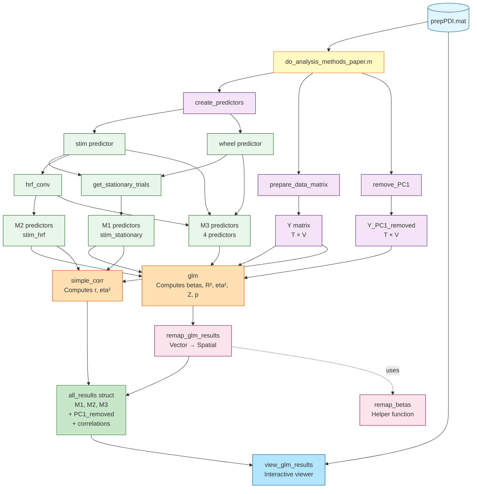

## 20260318 - Paper Methods Verification

After reviewing Chaoyi's paper, here are the key questions/checks to verify our implementation matches the paper:

### High Priority - Implementation Verification

1. **Preprocessing Pipeline Check**
   - [ ] Verify high-pass filtering (DCT, 0.002 Hz cutoff) is implemented
   - [ ] Verify frame rejection based on accelerometer (z > 3.5) is implemented
   - [ ] Verify pixel-wise artifact detection (z > 5) is implemented
   - [ ] Verify spatial smoothing (Gaussian, 1 sigma) is implemented

2. **Wheel Speed Conversion**
   - [ ] Confirm encoder → cm/s conversion (19π/1024) happens in `create_predictors.m`
   - [ ] Verify conversion happens BEFORE interpolation to frame times (as in paper)
   - [ ] Double-check stationary threshold is 2.0 cm/s (not 20.0 mm/s)

3. **GLM Running Predictors**
   - [ ] Verify M3 includes both `Running` (raw) AND `Running⊗HRF` (convolved)
   - [ ] Confirm we tested Running' (acceleration) and excluded it (negligible variance)
   - [ ] Verify interaction term: `(Stim * Running) ⊗ HRF` (multiply BEFORE convolving)

4. **Head Motion Predictor**
   - [ ] Clarify: Paper uses head motion ONLY for frame rejection, NOT as GLM predictor
   - [ ] Confirm our implementation matches this (no head motion in design matrix)

5. **Validation Metrics (for group-level analysis)**
   - [ ] Implement 2D spatial correlation between effect size maps
   - [ ] Implement CNR (Contrast-to-Noise Ratio) in target vs control regions
   - [ ] Implement paired t-tests across sessions
   - [ ] Implement Bayes factors (BF10) computation

6. **Shock/Noxious Stimulation Experiment**
   - [ ] Determine if we have shock stimulation data available
   - [ ] If yes, implement M4-M7 models from paper
   - [ ] M4: Baseline running reference
   - [ ] M5: Running across whole session
   - [ ] M6: Shock + ShockIntensity (no running correction)
   - [ ] M7: Shock + ShockIntensity + Running corrections

### Current Priority - Single Subject Analysis & Group-Level

## Open issues

None currently - wheelspeed conversion resolved (see Done section).

## Open tasks

- the viewer needs to show also the mask in the allen space. We already have the transformation matrix, so it should not be too difficult to transform the results in allen space
- maybe we can actually store the results in allen space?
- we need to use the correct hrf (asked Chaoyi)

## Done

- **Code refactoring and simplification (2026-02-16)**: 
  - Wheelspeed conversion now centralized in `create_predictors.m` with proper units (cm/s)
  - `create_predictors` now returns three outputs: `stim`, `wheel`, `stim_stationary`
  - Stationary trial selection logic integrated into `create_predictors`
  - Deleted obsolete functions: `get_stationary_trials.m` and `get_stationary_stim.m`
  - All predictor creation now happens in one place (cleaner architecture)
  - Comprehensive comments explaining wheelspeed conversion formula
  - Conversion factor: (19*pi/1024) where 19 cm = wheel diameter, 1024 = encoder resolution
  - Paper-accurate threshold: 2.0 cm/s for stationary trial selection

- `glm.m` now returns eta2, R2, Z, p. We did not retain residuals since they would be too big

- we implemented also a function to `remove_PC1` from the data, so that we can also fit the corresponding models

- the results can now be viewed with e.g. `view_glm_results(all_results, data, 'M3_PC1_removed')`. Clicking a pixel in the main effect of interest will show the corresponding time course and the model fit

- transform the current `do_analyses_methods_paper.m` into a function so that we can pass the session number and have it automatically find the prepPDI.mat

  - related to this, we need to devise a way to have a catalogue similar to what Chaoyi did with Datapath.m

- also **very important** for the moment the results are not saved. We will save them in a .mat file, but first we need to understand where, and which identifier to put in the saved .mat. If the prepPDI will be identified by the run number, most likely this will be the correct identifyer

  

## Data Flow

## Functions

`create_predictors.m`
Creates all predictors from prepPDI data: stimulus boxcar (all trials), wheel speed in cm/s, and stimulus boxcar for stationary trials only. Includes wheelspeed conversion and stationary trial selection logic.

`prepare_data_matrix.m`
Reshapes 3D fUSI data (PDI) from [ny × nz × T] to 2D matrix [T × V] using brain mask.

`remove_PC1.m`
Removes first principal component from data matrix (global signal regression).

---

### Predictor Transformations (1 function)

`hrf_conv.m`
Applies SPM canonical HRF (double-gamma) convolution to predictor for hemodynamic response modeling.

---

### GLM Analysis (3 functions)

`glm.m`
Fits GLM to all voxels, computes betas, R², eta², Z-scores, p-values. Auto-adds intercept.

`remap_glm_results.m`
Remaps all GLM statistics (betas, R², eta², Z, p) from vector [V] to spatial [ny × nz] format.

`remap_betas.m`
Helper function: remaps single statistic from vector [V] to spatial [ny × nz] using brain mask.

---

### Correlation Analysis (1 function)

`simple_corr.m`
Computes Pearson correlation (r) and effect size (eta²=r²) between predictor and all voxels, spatially remapped.

---

### Visualization (1 function)

`view_glm_results.m`
Interactive viewer: displays eta² maps, click to see voxel timeseries + model fit + predictors.

### Summary by Category

| Category      | Functions | Purpose                         |
| ------------- | --------- | ------------------------------- |
| Data Prep     | 3         | Load and reshape data           |
| Predictors    | 1         | Create and transform predictors |
| GLM           | 3         | Fit models and remap results    |
| Correlation   | 1         | Simple correlation analysis     |
| Visualization | 1         | Interactive result exploration  |
| TOTAL         | 9         | Complete pipeline               |
