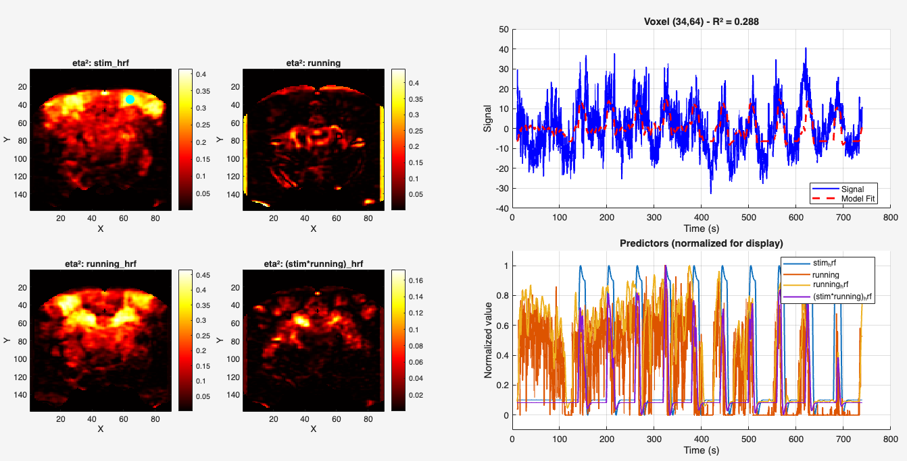

# fUSI GLM Analysis - Code Walkthrough


## 1. Loading data

```matlab
%% 1. Load Data
fprintf('Loading data...\n');
load('prepPDI.mat');

fprintf('  Data: [%d x %d x %d]\n', size(data.PDI, 1), size(data.PDI, 2), size(data.PDI, 3));
fprintf('  Brain voxels: %d\n\n', sum(data.bmask(:)));
```


Here we load the preprocessed data from the previous step. 

⚠️ : Right now it is assumed that the prepPDI is in the same directory. We will need to modify this later so that it accepts a ses (session) and run number from the Data Analysis directory.


## 2. Create Predictors
```matlab
%% 2. Create Predictors

speed_threshold = 10.0
time_lapse_treshold = 1000

fprintf('Creating predictors...\n');
[stim, wheel, stim_stationary] = create_predictors(data, speed_threshold, time_lapse_treshold);

% Visualize stationary trial selection (set to true to see plot)
plot_stationary_trials(data, stim, wheel, stim_stationary, speed_threshold, true);

TR = median(diff(data.time));
fprintf('  TR: %.3f sec\n\n', TR);
```

### Predictor Creation Process

> Extract the stationary trials : **"trials in which wheel velocity exceeded 2 cm/s for less than 200ms during the stimulation period"**

> This means: **Keep trials where the mouse NEVER moved continuously for more than 200ms at speeds > 2 cm/s**

The crucial part of the code is the following:
```matlab
CC = bwconncomp(wheel_during_trial > speed_threshold);
CCsize = cellfun(@(x) numel(x), CC.PixelIdxList);
```
In the first line, we create a logical vector of the time points - during the trial - where the wheel speed is > than the threshold

Then we count the length of each connected components, e.g. let's say that the following time points during the trial all have an exceeding wheel speed:

```
------ 6 ------      --- 3 --     ---- 4 ----
8 9 10 11 12 13      23 24 25     69 70 71 72
```
We care about the duration of the longest component, in this case `8..13`. 

Now we can calculate the duration of this longest component. We know that the sampling frequency is ~55Hz, which means that each time frame of the connected component lasts for about 18ms (1/55)

```
    timeDev = mean(diff(times_during_trial));
```

Therefore the connected component `8..13` lasts for $6 \cdot 18ms = 108ms$, which is _below_ the threshold of 200ms. Therefore in this case the trial will be considered _**stationary**_.

Therefore to summarize, this is what happens:
1. Create logical vector of time points exceeding threshold
2. Identify connected components (continuous periods)
3. Find the __longest__ component (not sum of all)
4. Calculate its duration using sampling interval
5. Compare to 200ms threshold
6. Accept trial if max_duration < 200ms

Below is a more detailed explanation of the entire code.


### Overview

This section creates three predictor variables that will be used in subsequent GLM models:

1. **`stim`** [T × 1] - Binary stimulus boxcar for all trials
2. **`wheel`** [T × 1] - Continuous wheel speed in cm/s  
3. **`stim_stationary`** [T × 1] - Binary stimulus boxcar for stationary trials only

All predictors are aligned to the imaging frame times defined in `data.time`.

---

### Input Data Structures

#### `data.time` - Imaging Frame Timestamps
- **Shape**: [1 × T] where T = number of imaging frames
- **Content**: Timestamp in seconds for each fUSI frame
- **Example**: `[0.000, 0.200, 0.400, 0.600, ...]` for TR ≈ 0.2s
- **Purpose**: Provides the temporal reference for all predictors

#### `data.stimInfo` - Stimulus Timing Table
- **Type**: MATLAB table with one row per stimulus trial
- **Key columns**:
  - `startTime`: Trial onset (seconds)
  - `endTime`: Trial offset (seconds)
  - `stimCond`: Stimulus condition identifier (optional)
- **Example**:
  ```
  Trial  startTime  endTime  stimCond
    1      10.5      25.5    'visual'
    2      70.2      85.2    'visual'
    3     130.8     145.8    'visual'
  ```
- **Purpose**: Defines temporal windows for stimulus presentation

#### `data.wheelInfo` - High-Resolution Wheel Measurements
- **Type**: MATLAB table sampled at ~55 Hz
- **Key columns**:
  - `time`: Timestamp for each wheel measurement (seconds)
  - `wheelspeed`: **Raw encoder counts per second** (not yet in cm/s)
- **Sampling rate**: ~55 Hz (one measurement every ~18ms)
- **Purpose**: Tracks continuous locomotor behavior with high temporal precision

---


#### Step 1: Wheel Speed Unit Conversion

The raw `wheelInfo.wheelspeed` data represents encoder counts per second and must be converted to cm/s.

**Physical parameters:**
- Encoder resolution: 1024 counts per full wheel rotation (2^10)
- Wheel diameter: 19 cm
- Wheel circumference: C = π × d = 19π ≈ 59.69 cm
- Linear distance per count: 19π/1024 ≈ 0.0584 cm

**Conversion formula:**
```matlab
wheel_cm_s = wheelInfo.wheelspeed × (19π/1024)
```

**Example:**
- Raw encoder value: 35 counts/sec
- Converted speed: 35 × 0.0584 ≈ 2.04 cm/s

This conversion is performed once at the beginning of `create_predictors.m`, ensuring all subsequent operations use physical units.

---

#### Step 2: Create Stimulus Boxcar for All Trials

A binary vector is constructed where each frame is marked as 1 (stimulus ON) or 0 (stimulus OFF):

```matlab
stim = zeros(T, 1);

for each trial in stimInfo:
    frames_during_trial = (frame_times >= startTime) & (frame_times <= endTime)
    stim(frames_during_trial) = 1
```

**Result**: Binary predictor indicating stimulus presence at each imaging frame.

**Example timeline:**
```
Time (s):  0    10   25   30   70   85   90  130  145  150
Stimulus:  0 0  1 1 1 1   0 0  1 1 1 1   0 0  1 1 1 1   0
           └─┘  └─Trial 1─┘ └─┘ └─Trial 2─┘ └─┘ └─Trial 3─┘
```

---

#### Step 3: Stationary Trial Selection

This implements the paper's trial-level filtering criterion:

> "trials in which wheel velocity exceeded 2 cm/s for less than 200ms during the stimulation period"

The algorithm evaluates each trial independently:

##### 3a. Extract trial-specific wheel data
```matlab
wheel_during_trial = wheel_cm_s(wheelInfo.time within [startTime, endTime])
```
- Uses high-resolution wheelInfo data (~55 Hz)
- A 5-second trial yields ~275 wheel measurements

##### 3b. Identify continuous movement periods

```matlab
CC = bwconncomp(wheel_during_trial > speed_threshold)
```

The `bwconncomp` function identifies connected components—continuous regions where the threshold is exceeded:

```
Wheel speed (cm/s): [1.5, 1.8, 3.2, 3.5, 3.1, 1.9, 1.7, 4.1, 4.3, 1.6]
Above threshold:    [ F,   F,   T,   T,   T,   F,   F,   T,   T,   F ]
                              └──Group 1───┘              └─Group 2┘
```

This returns separate groups of temporally contiguous supra-threshold samples.

##### 3c. Calculate duration of each movement period

```matlab
CCsize = [3, 2]  % Number of samples in each group
timeDev = mean(diff(times_during_trial))  % Sampling interval (~0.018s)

Duration of Group 1: 3 × 18ms = 54ms
Duration of Group 2: 2 × 18ms = 36ms
```

##### 3d. Apply trial acceptance criterion

```matlab
max_continuous_duration = max([54ms, 36ms]) = 54ms

if max_continuous_duration < 200ms:
    Accept trial as stationary
else:
    Reject trial as running
```

**Critical distinction**: The algorithm checks the **maximum duration of any single continuous period**, not the cumulative sum of all movement periods. This ensures that trials with multiple brief movements (e.g., 3 periods of 50ms each) are still accepted, while trials with sustained locomotion (e.g., 1 period of 250ms) are rejected.

**Output**: Frames corresponding to accepted trials are marked as 1 in `stim_stationary`.

---

#### Step 4: Resample Wheel Data to Frame Times

The converted wheel speed data must be temporally aligned with the imaging acquisition:

```matlab
wheel = interp1(wheelInfo.time, wheel_cm_s, frame_times, 'linear')
wheel = abs(wheel)  % Take magnitude
```

**Rationale:**

The wheel and imaging data have different sampling rates:
- **Wheel data**: ~55 Hz (one measurement every ~18ms)
- **fUSI imaging**: ~5 Hz (one frame every ~200ms)

For the GLM to work, all predictors must be aligned to the same timepoints. The `interp1` function estimates wheel speed at each imaging frame time by linear interpolation between adjacent wheel measurements.

**Example:**
```
Wheel measurements:  • • • • • • • • • • • • •    (55 Hz)
fUSI frames:         ✱         ✱         ✱        (5 Hz)
                     ↑         ↑         ↑
                  t=0.0    t=0.2     t=0.4

At each ✱, interpolate wheel speed from nearby • measurements
```

**Edge handling**: Any NaN values (typically at temporal boundaries) are filled using nearest-neighbor interpolation.

**Result**: All three predictors (`stim`, `wheel`, `stim_stationary`) are now aligned to the same T timepoints, enabling their use in the GLM.

---

### Output Predictors

#### 1. `stim` [T × 1]
- Binary predictor encoding all stimulus presentations
- Used in Models 2 and 3
- Represents the "ideal" stimulus-driven response

#### 2. `wheel` [T × 1]
- Continuous wheel speed in cm/s
- Temporally aligned to imaging frames
- Used in Model 3 as nuisance regressor for motion-related variance

#### 3. `stim_stationary` [T × 1]
- Binary predictor encoding only stationary trials
- Subset of `stim` where locomotion was minimal
- Used in Model 1 as reference for "clean" stimulus responses

---

### Biological Rationale

The stationary trial selection enables:

1. **Reference estimation** (Model 1): Characterize stimulus-evoked responses in the absence of movement-related confounds
2. **Method validation** (Models 2 vs 3): Demonstrate that explicit motion modeling (M3) recovers response patterns similar to the stationary reference (M1)
3. **Motion quantification**: Assess the contribution of locomotion to measured hemodynamic signals across different brain regions

---

### Additional Outputs

**TR Calculation:**
```matlab
TR = median(diff(data.time))
```
Computes the repetition time (frame-to-frame interval) from the imaging timestamps. This is required for subsequent HRF convolution.

**Visualization:**
```matlab
plot_stationary_trials(data, stim, wheel, stim_stationary, speed_threshold, true)
```
Optionally displays trial-by-trial movement profiles and acceptance/rejection decisions for quality control.


## 3. Prepare Data Matrices
```matlab
%% 3. Prepare Data Matrices
fprintf('Preparing data matrices...\n');
Y = prepare_data_matrix(data.PDI, data.bmask);
Y_PC1_removed = remove_PC1(Y);
fprintf('\n');
```

### Code Explanation

Transform the 3D data (Y*Z*time) into a 2D matrix (time*voxels) in order to prepare for estimating PCA

```matlab
Y = prepare_data_matrix(data.PDI, data.bmask);
```

Then estimate the PCA of the T*V matrix and then removes the first component (and adds the mean again)

```matlab
Y_PC1_removed = remove_PC1(Y);
```

**NB : from now on we keep the data as `T*V`** since it's easier for fitting the models. We will reshape back the `T*V` to `Y*Z` - parameter estimates / eta2 and whatnot - only later on.


## 4. Fit Models
```matlab
%% --- MODEL 1: Stimuli while stationary ---
fprintf('M1: Stimuli while stationary\n');
M1_predictors = stim_stationary;
M1_labels = {'stim_stationary'};
glm_estimate = glm('M1', Y, M1_predictors, M1_labels);
all_results.M1 = remap_glm_results(glm_estimate, data.bmask);
all_results.M1.X = [M1_predictors, ones(size(M1_predictors,1),1)];  % Store design matrix

% M1 With PC1 removal
glm_estimate = glm('M1_PC1_removed', Y_PC1_removed, M1_predictors, M1_labels);
all_results.M1_PC1_removed = remap_glm_results(glm_estimate, data.bmask);
all_results.M1_PC1_removed.X = [M1_predictors, ones(size(M1_predictors,1),1)];


% M1 simple correlation
all_results.M1_corr = simple_corr(stim_stationary, Y, data.bmask);
```

### Code Explanation

The structure of the `glm()` call is the same for all three models. 

What differentiates the models are the `M[n]_predictors` and the corresponding `M[n]_labels`.

```bash
M1 : stim_stationary      # only stationary trials
M2 : hrf_conv(stim, TR);  # all trials
M3 : [hrf_conv(stim, TR), wheel, hrf_conv(wheel, TR), hrf_conv(stim.*wheel, TR)]
```

where: 
- `hrf_conv()` is the function that convolves the predictor with the canonical hrf (`hrf_params` inside the same script `hrf_conv.m`)
- `.*` denotes interaction between two predictors


- `glm('M[n]', Y, M1_predictors, M1_labels)` : fits the model and returns betas, R2, eta2, Z, p (besides predictor_labels and model_name)
  - importantly, an intercept is also added, which is _always_ the last predictor.
- `remap_glm_results(glm_estimate, data.bmask)` : remaps the parameter estimates and all the stats in the Y*Z format
- the same is then repeated for the data after the PC1 has been removed
- `simple_corr(stim, Y, data.bmask)` : is the basic Pearson correlation
- `all_results.M1.X = [M1_predictors, ones(size(M1_predictors,1),1)]` : Store complete design matrix (including intercept) for interactive viewer. The viewer needs this to overlay predictors on the timeseries plot


⚠️ **IMPORTANTLY, if no stationary trials are found, the estimation of the M1* models will be skipped and noted as such in the prepPDI.mat**


Finally, the results can be viewed - interactively - with the 
```
view_glm_results(all_results, data, 'M3')
```



By pointing and clicking on a location in the eta2 plot, the signal, model fit, R2 and predictors time course (convolved with hrf if specified) will be displayed for that location.


## 5. Saving the results
```matlab
fprintf('\nSaving results to prepPDI.mat...\n');
data.glm_results = all_results;

% Save back to the same file (overwrites original)
save('prepPDI.mat', 'data', '-v7.3');
```

The results are saved in a field `all_results` within the original `prepPDI.mat`

