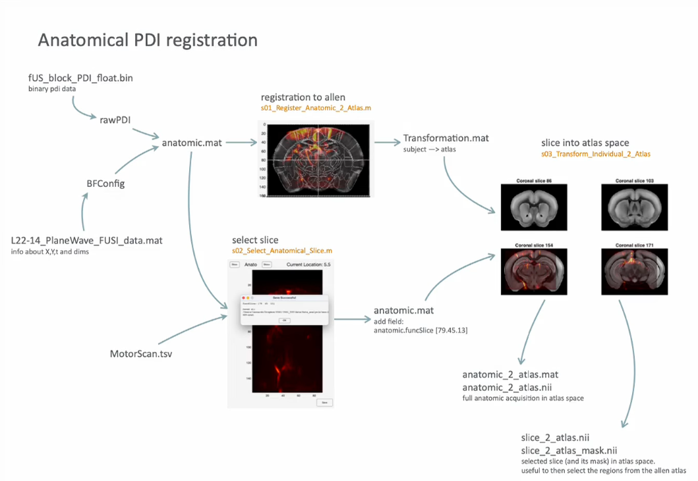
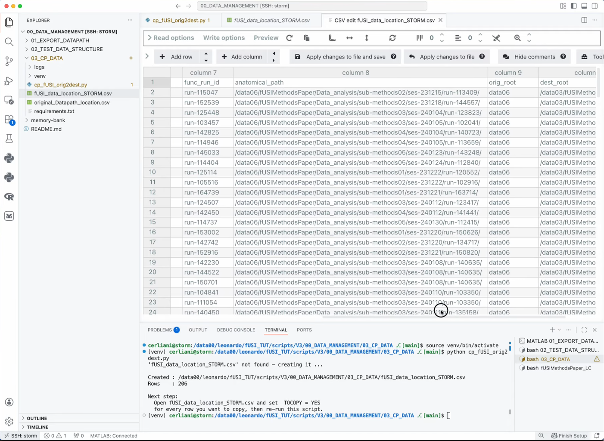
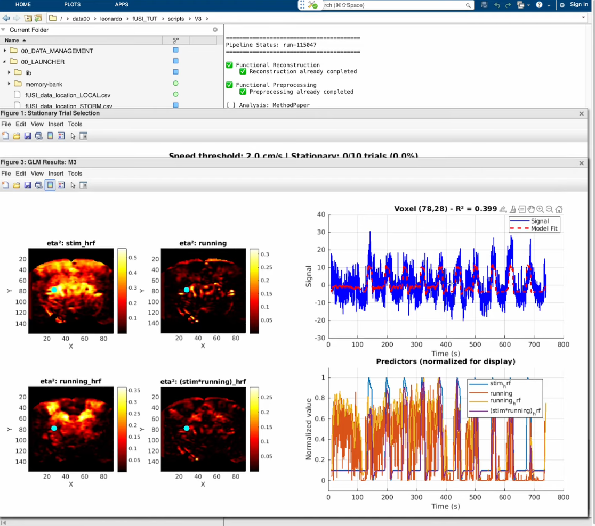

# fUSI TUT data management and processing pipeline.

_LC 2026-04-03_

## Motivation
Here you can find the code for the latest (V3) version of the code for data management, processing steps and CLI interface to the pipeline for reconstructing, preprocessing and analysis (hereafter: RPA) on fUSI data.

The latter is a refactoring of the code generated by Chaoyi, without whom I would have been totally lost. This refactoring serves two main purposes:

- to generate a modular code base which is more intuitive to modify, maintain, interrogate and update

- to build at the same time a tutorial for learning and exploring doing analysis on fUSI data

- to build a CLI interface to carry out RPA of fUSI data, using as a source of files location a csv table 


## How to use this tutorial
This tutorial is made to work _on storm only_. The idea is to copy the initial data for RPA in a new directory of your choice, without touching the content/analysis created by Chaoyi on `/data06`.

First, of course, clone the repo in your favourite location _on storm_.

Then go through _all_ the steps explained in the [Data management video](https://www.youtube.com/watch?v=nTfqBgpA7Vs) (you can find the scripts in the `00_DATA_MANAGEMENT` folder). This will guide you to create _your own_ `fUSI_data_location_STORM.csv` file. The ones provided in the repo are just examples and you should not use them - otherwise you will overwrite other people's data loaction - but rather the one you will create with your location preferences. 

To set up the location you desire to run the tutorial on, you can modify the following parameters in the `cp_fUSI_orig2dest.py` in the `00_DATA_MANAGEMENT/03_CP_DATA` folder once you have cloned this repo in a location of your choice

```python
DEST_BASE   = '/data03'   # base mount point
PROJ_SUFFIX = '_LC'       # appended to every project folder name
```

Just follow the steps in the [Data management video](https://www.youtube.com/watch?v=nTfqBgpA7Vs) and you will be fine.


## Detailed description of each step of the pipeline
There are detailed README files for almost each part of the code, and a `memory-bank` that can be included in further sessions with [Cline](https://cline.bot/) (preferrably using Claude Sonnet 4.6+).

I still didn't have the time to generate a written version of this overall readme file, however **there are some videos which explain the main procedures**.


## Anatomical reconstruction and registration to the Allen atlas
This is done at experiment time, therefore it is unlikely that it will be needed by any user who will "just" run RPA. However, it is good to know how it works. [`CMD/Crtl+Click` here or on the picture below to watch the video tut](https://www.youtube.com/watch?v=mwABeCqeyDc)

<p align="center">
  <a href="https://www.youtube.com/watch?v=mwABeCqeyDc" target="_blank" rel="noopener noreferrer">
    
  </a>
</p>


## Data management using a csv file for data localization / copying / pipeline launching
While previously the `Datapath.m` was use to retrieve the location of the data and launch steps of the pipeline, I opted for a csv file, which possibly allows an easier way to inspect the file location. The particular one created here - following the steps in `00_DATA_MANAGEMENT` - also allows to easily copy the data from the source location in `data06` to the location you decide to run the tutorial on. [`CMD/Crtl+Click` here or on the picture below to watch the video tut](https://www.youtube.com/watch?v=nTfqBgpA7Vs)

<p align="center">
  <a href="https://www.youtube.com/watch?v=nTfqBgpA7Vs">
    
  </a>
</p>


## Pipeline launcher
The single steps of the RPA are detailed in the folders

```
02_Func_Reconstruction
03_Func_Preprocessing
04_Analysis_MethodPaper
```

The scripts for each step can be run independently, however I advise to start with the `fusi_pipeline_launcher('[functional run id]')` in `00_LAUNCHER`, as it provides an intuitive way to:
- check which steps have already been run
- run several steps in sequence
- re-run a specific step

**IMPORTANTLY, before using the launcher, make sure you have copied the last version of your generated `fUSI_data_location_STORM.csv` from the `00_DATA_MANAGEMENT/03_CP_DATA` to the `00_LAUNCHER` folder**. The current ones in the repo serve just as examples and should be generated from scratch according to your choice of where you want your tutorial to run (I know, it's still quite rough, but I will make it better in the future). [`CMD/Crtl+Click` here or on the picture below to watch the video tut](https://www.youtube.com/watch?v=XFna2kEZglg)

<p align="center">
  <a href="https://www.youtube.com/watch?v=XFna2kEZglg">
    
  </a>
</p>
